import { Callout } from 'nextra/components'
import Zoom from 'react-medium-image-zoom'

# Built-in Clamping

Clamping of Attribute, to ensure that their values are always within the limits that you set for them, is a common pattern. That's why Blueprint Attributes plugin come with some pre-defined and built-in clamping behavior that you can opt-in.

You can perform Attributes clamping with one of three methods, two of which are the built-in clamping features coming with the plugin.

**[with DataTable](#with-datatable)*- To initialize the Attributes, and using the MinValue and MaxValue columns. The Attribute Set Blueprint Base class is able to handle those Min/Max column values, and execute a built-in clamping behavior. 
**[with Gameplay Clamped Attribute Data properties](#with-gameplay-clamped-attribute-data-properties)*- A customizable clamping using a special Gameplay Clamped Attribute Data property (a child of FGameplayAttributeData) with float or Attribute-based clamping.
**[Manual Clamping](#manual-clamping)*- You'd implement the clamping behavior yourself, with your own rules with the BP exposed method / events of Attribute Sets (PreAttributeChange(), PreAttributeBaseChange() or PostGameplayEffectExecute())

`UGBAAttributeSetBlueprintBase::PostGameplayEffectExecute()` is the method responsible of clamping, and the order for those is the following:

1. Manual Clamping (if done in PostGameplayEffectExecute BP Event)
2. Clamping via Clamped Properties (if the Attribute is implemented as a `FGBAGameplayClampedAttributeData`).
3. Clamping via DataTables Min and Max value columns (if the Set was initialized with a DataTable, and if `MinValue < MaxValue`).

**Test Setup **

To better illustrate the clamping behavior in-game, we'll use Gameplay Effects with Infinite duration to setup a regen and degen mechanic for the Health Attribute.

<Callout type="info">
You could also use Gameplay Abilities activated on Input, to apply an Instant Gameplay Effect to either damage or heal the Character (by adding or removing a set of amount of Hit Points from the Health Attribute).
</Callout>

<Callout type="default">
This demonstration setup can be found in the [Content Examples project](/docs/resources/content-examples-project) in the `02_Builtin_Clamping` map.

Also, most of the assets specific to this example are prefixed with `GE_Clamping_` to easily find them in the Editor with `Ctrl+P`.
</Callout>

For these instructions, I'm using an AttributeSet made just for this clamping demonstration, with a single Health Attribute variable.

*GBA_Clamping_Example_HealthSet*
<Zoom>

</Zoom>

And two Gameplay Effects, one to continuously add to the Health Attribute, one to continuously substract from the Health Attribute.

*GE_Clamping_HealthRegen*
<Zoom>
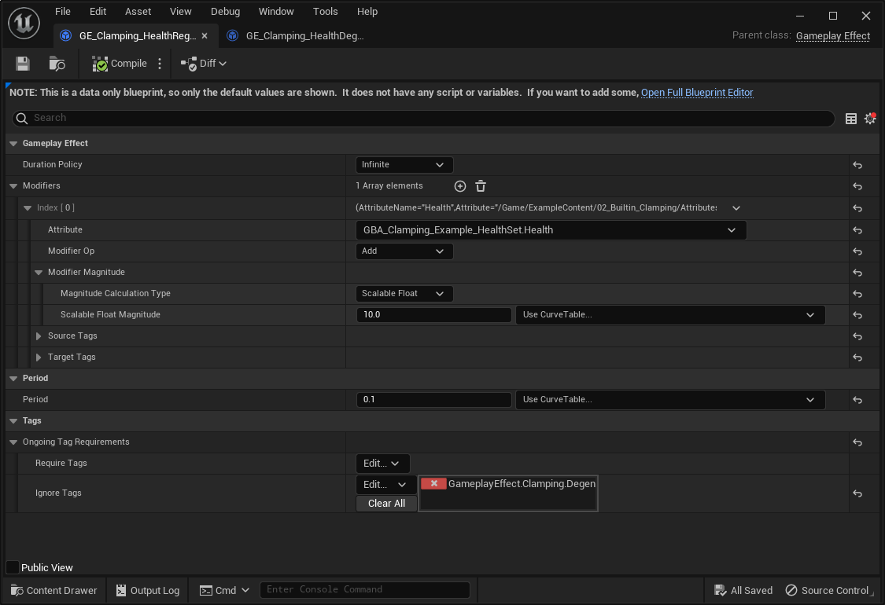
</Zoom>

*GE_Clamping_HealthDegen*
<Zoom>
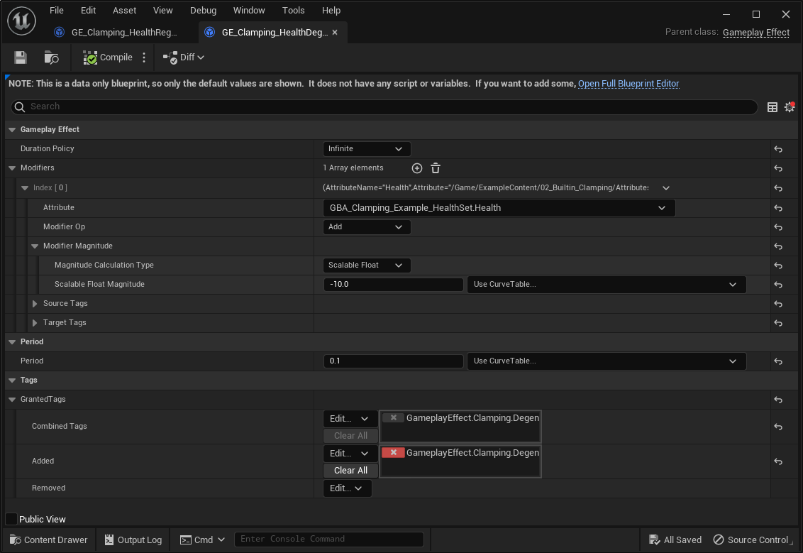
</Zoom>

Both are Infinite Gameplay Effects, with a Period duration of `0.1`, and either adds or remove `10` from the Health Attribute every 100ms.

`GE_Clamping_HealthRegen` is configured to only be active if the Owner Character doesn't have `GameplayEffect.Clamping.Degen` Gameplay Tag, which is added by `GE_Clamping_HealthDegen` whenever it's applied.

Next, we need to ensure the Regen Gameplay Effect is applied. Since it's an Infinite Effect, it'll be active indefinitely (or until explicitly removed).

You can simply apply the effect programmatically on Begin Play (or Possesed) event, or using the list of Gameplay Effects to apply your GAS bakend could provide to you (GAS Companion's ASC Granted Effects, or Lyra's Ability Sets and Granted Gameplay Effects)

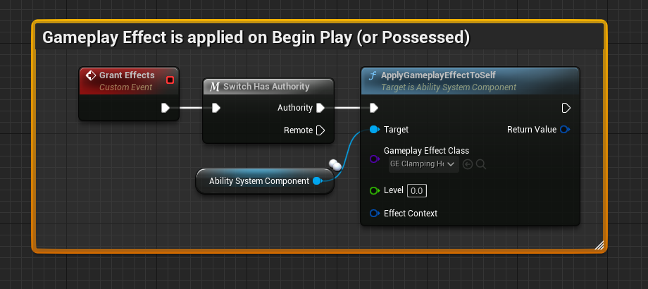

Without any clamping applied, the Health Attribute value will go up indefinitely.

And similarly go down if we apply the Degen effect (which is done in the Content Examples project by stepping onto the Button Pad Blueprint).

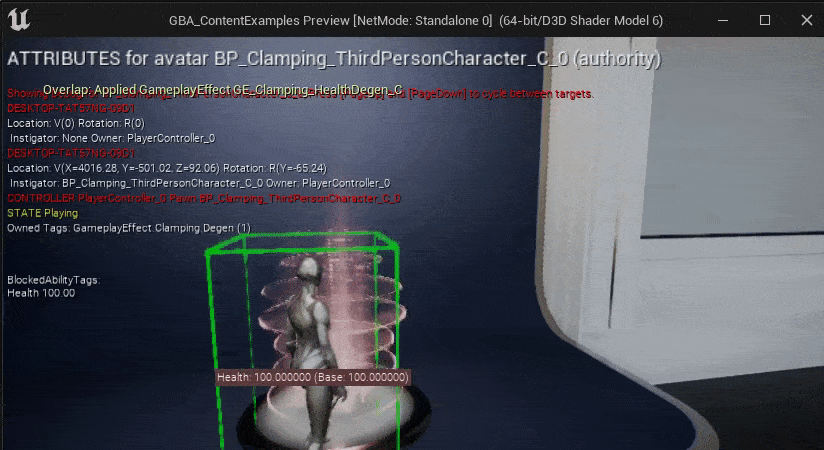

## With DataTable

This is the simplest and quickest way to get clamping done for Gameplay Attributes.

This implies you're using a DataTable to initiliaze your Attribute values (eg. [Data Tables section](#data-tables)).

<Zoom>

</Zoom>

If we build upon our previous Attribute Set example, with a single Health Attribute, we can tweak the DataTable used for initialization and set the Min and Max value columns to arbitrary values. In the following example, we'll init the value to 0, but configure the clamping to ensure the value will be between 10 and 100.

If we launch the game in PIE, we can see the value for the Health Attribute initialized to 10 (started at 0, then clamping took place and set it to 10)

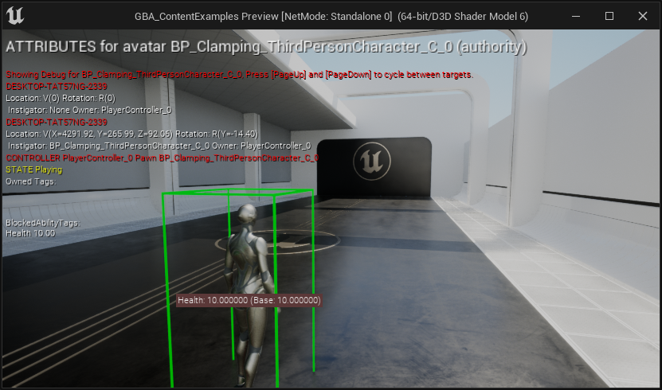

To test lower and higher bound limits we configured for the clamping, we can use the Regen / Degen effect described in the [Test Setup section](#built-in-clamping-testsetup).

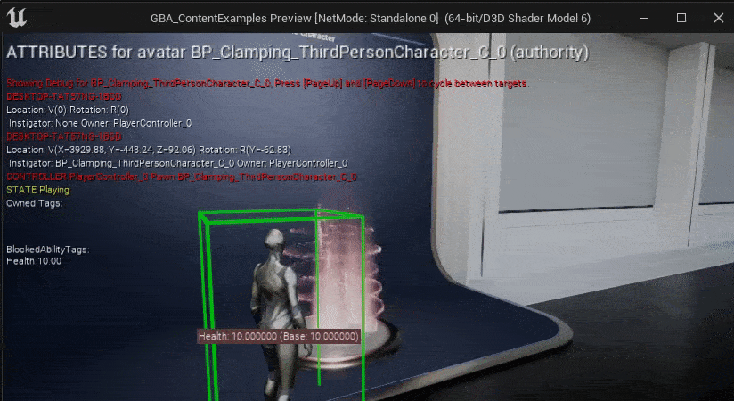

## With Gameplay Clamped Attribute Data properties

Add a new Attribute for your set, but this time using a `FGBAGameplayClampedAttributeData`. You can quickly do so by clicking on the "Add Attribute" button in the Blueprint Editor Toolbar, and choosing the appropriate type.

<Callout type="default">
Once again, you can find the implementation described here as part of the [Content Examples project](/docs/resources/content-examples-project) in the `02_Builtin_Clamping` map.
</Callout>

This time, we are going to implement an `Endurance` Attribute (a classic! sometimes also called Stamina) that could act as a resource cost for a given set of actions. In this simple example, we'll reuse the Regen mechanic and temporarily increase the higher clamp limit when we step onto a Button Pad.

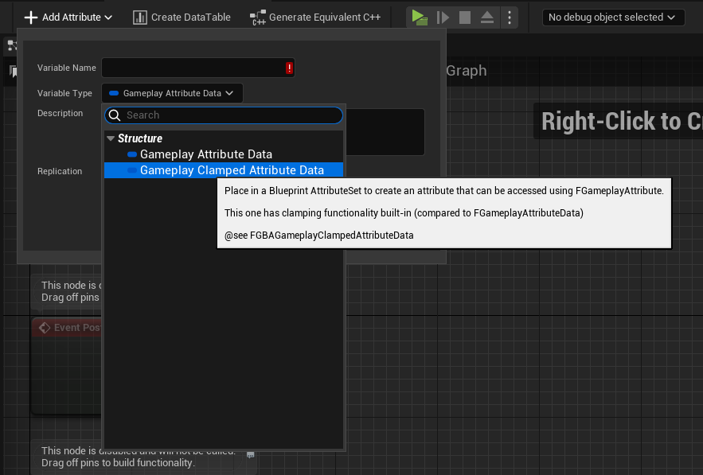

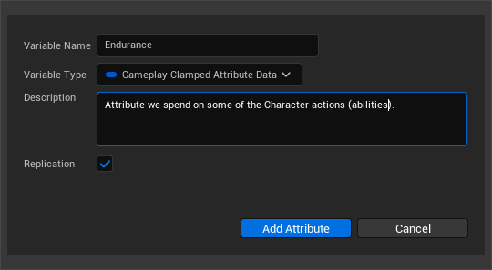

If you then compile the Blueprint and select the newly added variable, you'll see in the Details panel a slightly different display.

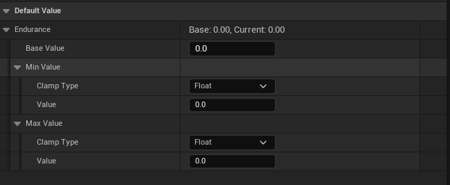

`FGBAGameplayClampedAttributeData` is a child struct of `FGameplayAttributeData`, it contains the usual Base Value, along with two new `FGBAClampDefinition` properties: a `MinValue` and a `MaxValue`.

The Clamp definition for both of these provides a `Clamp Type` behavior:

- **Float Based (default)**: Uses a simple, static float for the clamping.
- **Attribute Based**: Performs a clamping based upon another attribute.
- **None**: Clamping is disabled for this definition.

We need another Attribute to demonstrate the Attribute Based clamping type for our `Endurance` attribute called `MaxEndurance`. Let's quickly create the new attribute.

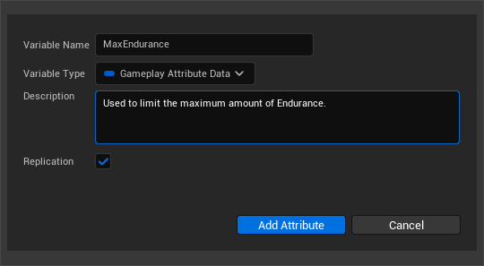

You can then give it an arbitrary value (and / or use an initialization DataTable to set its value):

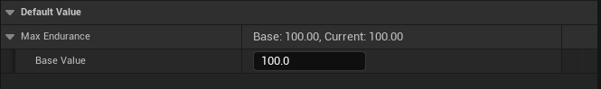

We can then go back to the clamped definitions of `Endurance`, by selecting the variable or using the Class Defaults view, and adjust the clamping definition for `MaxValue` to be based on the `MaxEndurance` attribute.

<Zoom>
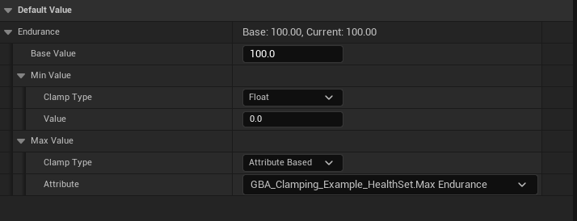
*We also changed the initial Base Value to be at 100 to make it start from the higher limit.*
</Zoom>

<Callout type="default">
Take note that only the Attributes belonging to the same Attribute Set are intentionally selectable. This deliberate design choice serves to prevent interdependence between different Attribute Set classes and to maintain the principle of encapsulation.
</Callout>

**Test Setup **

Let's quickly create a few Gameplay Effects to play around our new `Endurance` attribute value. We'll need:

- A regen Gameplay Effect to continuously add a certain amount of `Endurance` point.
- A Gameplay Effect to arbitrarely change the value of `MaxEndurance` attribute (imagine equipping an item that increase the total amount of Endurance available) which is going to indirectly affect the maximum value for the `Endurance` attribute.

<Callout type="info">
The few following Blueprints are set to "Show Only Modified Properties"
</Callout>

**GE_Clamping_EnduranceRegen**
<Zoom>
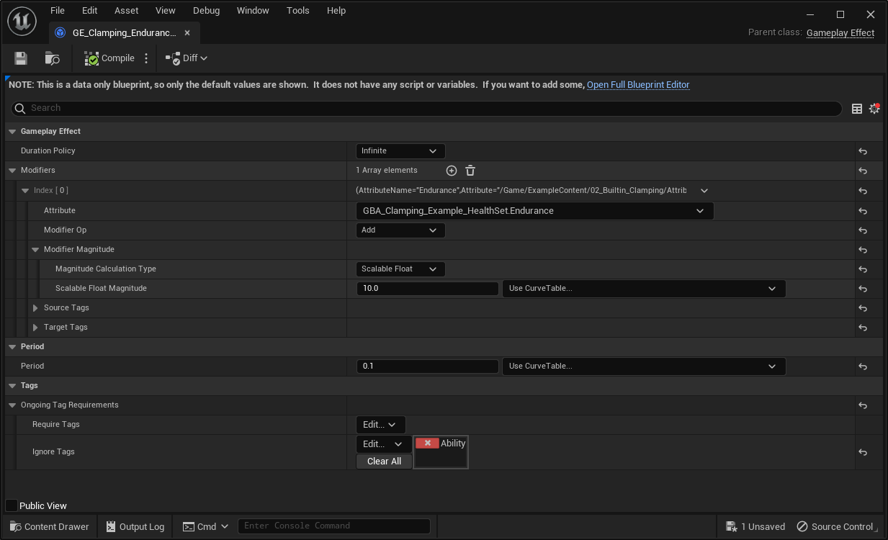
*This is an infinite Gameplay Effect*
</Zoom>

**GE_Clamping_MaxEnduranceBuff**
<Zoom>
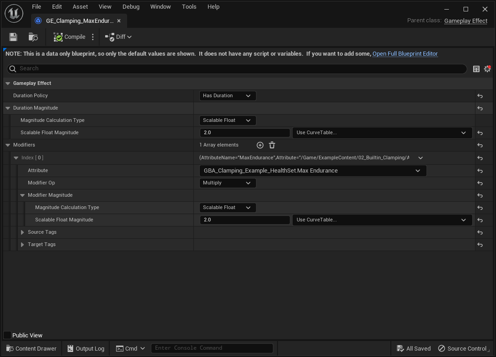
*This is a duration Gameplay Effect, meaning it will only last for 2 second, and increase `MaxEndurance` by 100%.*
</Zoom>

<Callout type="warning">
Don't forget to apply **GE_Clamping_EnduranceRegen*just like we did for the HealthRegen as one of the startup effects to apply.
</Callout>

Time to PIE test. Here we used the `AbilitySystem.DebugAttribute Endurance MaxEndurance` command once to display their value as an additional overlay.

  

    <svg aria-hidden="true" height="16" viewBox="0 0 16 16" version="1.1" width="16" data-view-component="true" className="octicon octicon-device-camera-video">
    <path d="M16 3.75v8.5a.75.75 0 0 1-1.136.643L11 10.575v.675A1.75 1.75 0 0 1 9.25 13h-7.5A1.75 1.75 0 0 1 0 11.25v-6.5C0 3.784.784 3 1.75 3h7.5c.966 0 1.75.784 1.75 1.75v.675l3.864-2.318A.75.75 0 0 1 16 3.75Zm-6.5 1a.25.25 0 0 0-.25-.25h-7.5a.25.25 0 0 0-.25.25v6.5c0 .138.112.25.25.25h7.5a.25.25 0 0 0 .25-.25v-6.5ZM11 8.825l3.5 2.1v-5.85l-3.5 2.1Z"></path>
</svg>
    *By stepping onto the Pad Button, we apply the Gameplay Effect buff to increase temporarily our `MaxAttribute` value for 2s (or removed when we step out of the Pad).*
    
  

  <video src="/videos/AttributeSets_Clamping_Property_10.mp4" controls="controls" muted="muted" className="d-block rounded-bottom-2 border-top width-fit" style={{ maxHeight: "640px", minHeight: "200px"}}>
  </video>

## Manual Clamping

Manual clamping resort to your own implementation using some of the Blueprint exposed methods of UAttributeSet you can implement or override.

### Using PreAttributeChange() and PreAttributeBaseChange()

Click on the "Override" dropdown in the functions tab to override the function `PreAttributeBaseChange` in Blueprint.

<Zoom>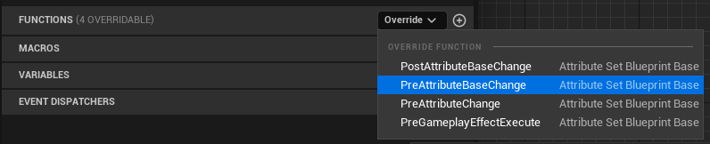</Zoom>

Same for `PreAttributeChange` function.

<Zoom>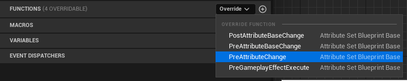</Zoom>

And we'll implement both exactly the same way (you could create an helper function in your Blueprint to handle the clamping, and call that method from both of these places).

<Callout type="default">
`Switch on Gameplay Attribute` K2 Node is a custom node implemented by the plugin (originally implemented in GAS Companion, and ported over here in Blueprint Attributes). This is one of the few features both plugins share and each implement their own identical version of the node.
</Callout>

<Zoom>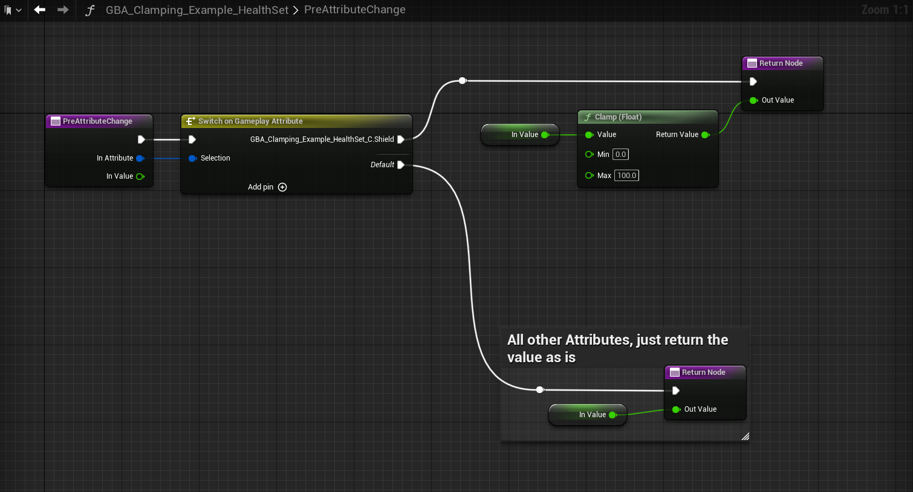</Zoom>
<Zoom>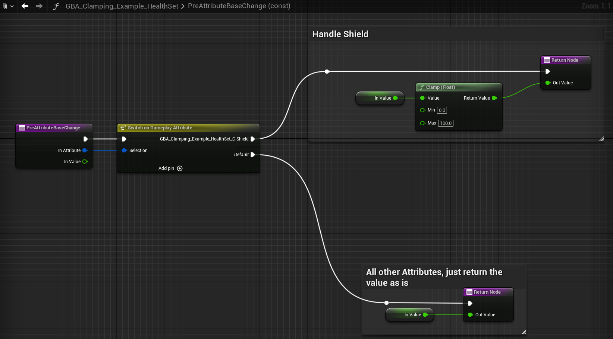</Zoom>

`In Value` float represents the initial Base or Current value (Base for `PreAttributeBaseChange` method, Current - sometimes also called Final - Value for the `PreAttributeChange`).

Both of these methods must return an `Out Value` float which is going to be new clamped value for the Attributes we care about (here we only deal with the Shield Attribute). For any other attributes that doesn't need clamping, we simply return the initial `In Value`.

### Using PostGameplayEffectExecute()

When the AttributeSet Blueprint is first created, the event is implemented by default but disabled.

<Zoom>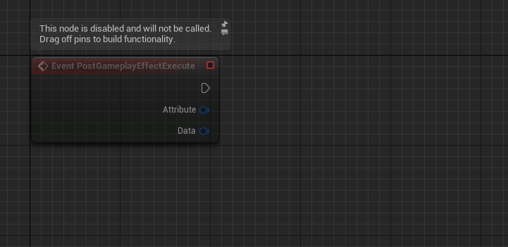</Zoom>

In the event the node is missing or you previously deleted it, you can click on the "Override" dropdown again in the functions tab to implement the `PostGameplayEffectExecute` event in Blueprint.

<Zoom>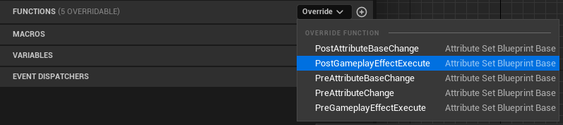</Zoom>

As for the implementation, you can implement the clamping using `ClampAttributeValue` helper of `UGBAAttributeSetBlueprintBase` (displayed `Attribute Set Blueprint Base`) parent class.

<Zoom>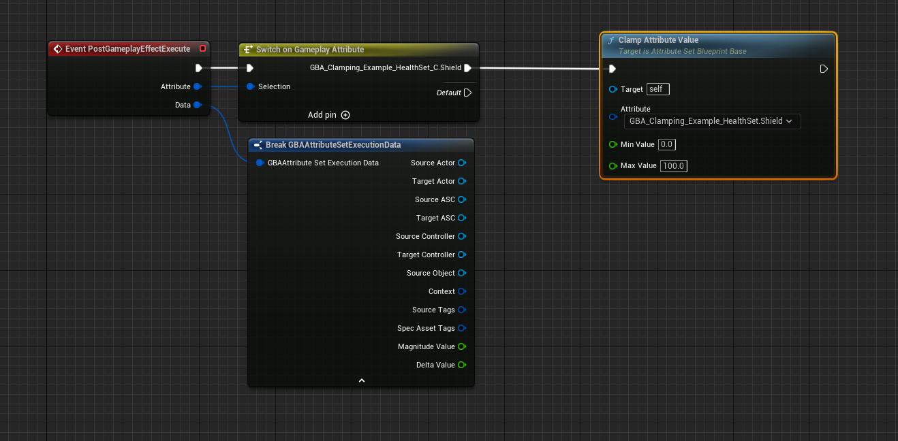</Zoom>