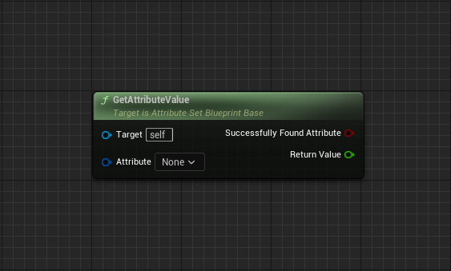
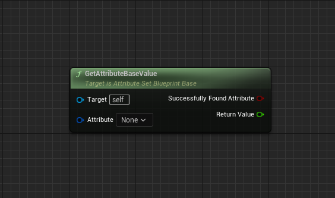
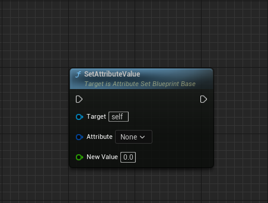
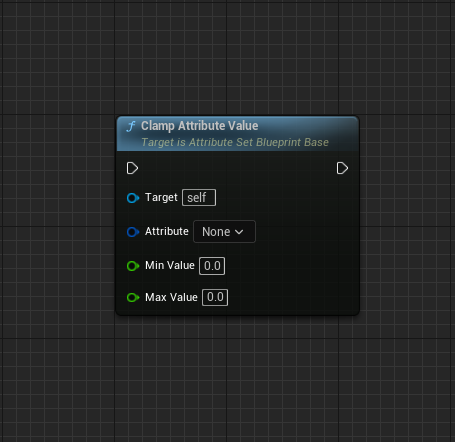
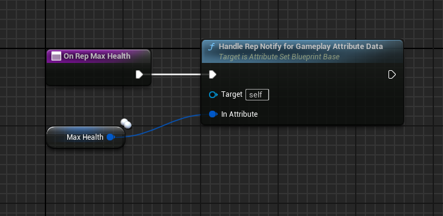
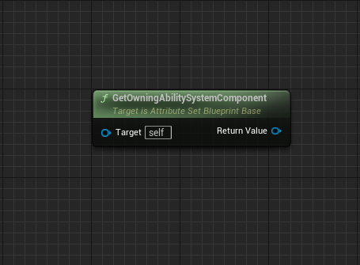
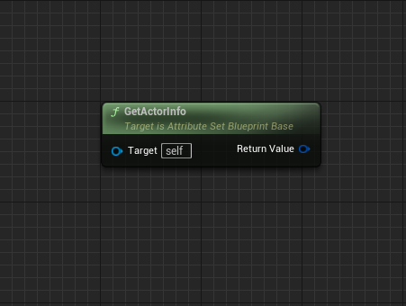

import { Callout } from 'nextra/components'
import Zoom from 'react-medium-image-zoom'

# Helper Methods

Additionnaly, `UGBAAttributeSetBlueprintBase` defines a few custom helper intended to be used when implementing the AttributeSet events / methods described earlier.

## GetAttributeValue()

<Zoom></Zoom>

**Method description**

Returns the *current* (as opposed to base) value of an Attribute.

<Callout type="default">
This method acts as a simple proxy towards `UAbilitySystemBlueprintLibrary::GetFloatAttributeFromAbilitySystemComponent()` with the ASC returned from [`GetOwningAbilitySystemComponent()`](#getowningabilitysystemcomponent)
</Callout>

**Parameters**

| Name                          | Type                | Description                                               |
| :-----                        | :----               | :----                                                     |
| Attribute                     | FGameplayAttribute  | The Gameplay Attribute we want to get the current value  |
| bSuccessfullyFoundAttribute   | bool                | Return value indicating whether the value was retrieved successfully (false if owning ASC is invalid or if the AttributeSet the input Attribute belongs to is not granted) |

## GetAttributeBaseValue()

<Zoom></Zoom>

**Method description**

Returns the *base* (as opposed to current) value of an Attribute.

<Callout type="default">
This method acts as a simple proxy towards `UAbilitySystemBlueprintLibrary::GetFloatAttributeBaseFromAbilitySystemComponent()` with the ASC returned from [`GetOwningAbilitySystemComponent()`](#getowningabilitysystemcomponent)
</Callout>

**Parameters**

| Name                          | Type                | Description                                               |
| :-----                        | :----               | :----                                                     |
| Attribute                     | FGameplayAttribute  | The Gameplay Attribute we want to get the base value  |
| bSuccessfullyFoundAttribute   | bool                | Return value indicating whether the value was retrieved successfully (false if owning ASC is invalid or if the AttributeSet the input Attribute belongs to is not granted) |

## SetAttributeValue()

<Zoom></Zoom>

**Method description**

Sets the *base* (as opposed to current) value of an Attribute.

<Callout type="default">
You'll get a warning if owning ASC is null, and an ensure error if the AttributeSet the input Attribute belongs to is not granted.
</Callout>

**Parameters**

| Name        | Type                | Description                                           |
| :-----      | :----               | :----                                                 |
| Attribute   | FGameplayAttribute  | The Gameplay Attribute we want to set the base value  |
| NewValue    | float               | Float value to set                                    |

## ClampAttributeValue()

<Zoom></Zoom>

**Method description**

Clamps the Attribute from MinValue to MaxValue

<Callout type="default">
You'll get a warning if owning ASC is null, and an ensure error if the AttributeSet the input Attribute belongs to is not granted.
</Callout>

**Parameters**

| Name        | Type                | Description                                         |
| :-----      | :----               | :----                                               |
| Attribute   | FGameplayAttribute  | Gameplay Attribute to clamp the value               |
| MinValue    | float               | The lower bound float to clamp the value within     |
| MaxValue    | float               | The higher bound float to clamp the value within    |

## GetOwningActor()

<Zoom></Zoom>

**Method description**

Gets information about owning actor.

**Return value**

`AActor*` usually representing the OwningActor of the ASC.

## GetOwningAbilitySystemComponent()

<Zoom></Zoom>

**Method description**

Returns the Ability System Component of the Owning Actor.

**Return value**

`UAbilitySystemComponent*` of the Owning Actor.

## GetActorInfo()

<Zoom></Zoom>

**Method description**

Returns the Owner's Ability System Component cached data about the owning actor that abilities will need to frequently access (movement component, mesh component, anim instance, etc)

**Return value**

`FGameplayAbilityActorInfo` representing the ActorInfo of the Owning Actor.

<Callout type="default">
You'll get an Error if we were unable to get back the ActorInfo cached pointer, and result will be a default `FGameplayAbilityActorInfo` with none of its member properly populated.
</Callout>

## HandleRepNotifyForGameplayAttribute()

<Zoom></Zoom>

<Callout type="warning">
This method is meant to be used in the context of a RepNotify Blueprint implementation for an Attribute.
</Callout>

**Method description**

To be called from Blueprint rep notifies for a given Gameplay Attribute Data member variable.

Meant to provide the same prediction capabilities of GAMEPLAYATTRIBUTE_REPNOTIFY(UMyAttributeSet, Attribute, OldAttribute) macro that is usually called from within a C++ AttributeSet rep notify handler.

**Parameters**

| Name              | Type   | Description                                                |
| :-----            | :----  | :----                                                      |
| InPropertyName    | FName  | Attribute Name - must match the rep notify attribute name  |