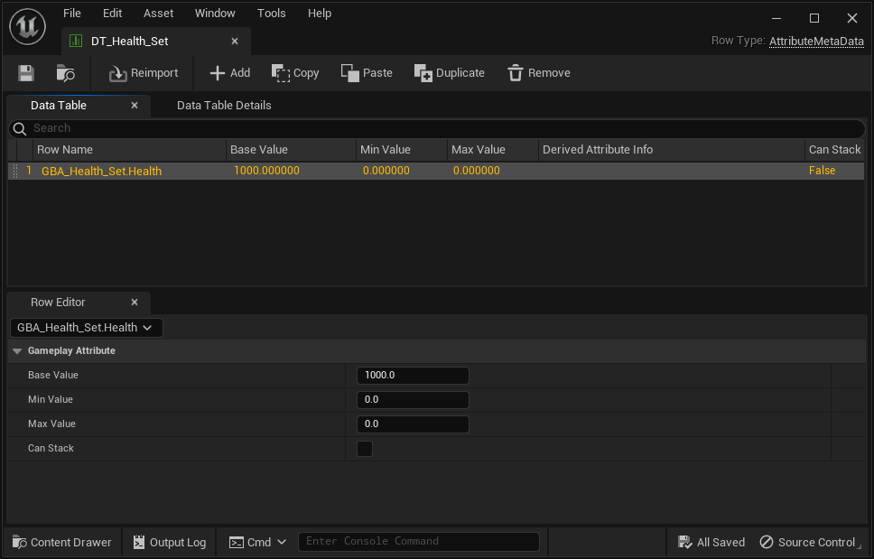

import { Callout } from 'nextra/components'
import Zoom from 'react-medium-image-zoom'

# Initialization

In this section, we'll talk about the various ways we have to initialize the Attribute values (the Base Value).

## Initializing Attributes

This is a good time to talk about a Blueprint Attributes plugin specific feature. If you select the Gameplay Attribute property in the Blueprint Editor, or click on the "Class Defaults" button in the toolbar, you'll be able to change the default Attribute value directly from within the Details Panel.

Set it to an arbitrary value, for example `100`.


<Callout type="info">
This is normally not an exposed value, and not editable in the Details panel, but an Editor Details customization of Blueprint Attributes plugin is taking care of exposing that to Blueprints.
</Callout>

This is the equivalent in C++ of setting a Gameplay Attribute default value via its constructor in an AttributeSet header:

```cpp
UPROPERTY(BlueprintReadOnly, Category = "Attributes", ReplicatedUsing = OnRep_Health)
FGameplayAttributeData Health = 0.0f;
```

If we now launch the game in PIE and use the Gameplay Debugger commands, we should see the Attribute with its new default value:


## Data Tables

Another popular way to initialize attributes beyond their default value, and further specialize Gameplay Attributes value based on the Actor (and ASC) it belongs, is through the use of Data Table.

Both the `InitStats()` method of the ASC and its Default Starting Data property (more infos and options in [Register Attribute Sets with the ASC](/docs/attribute-sets/registering-the-attribute-set-with-the-asc)) accepts an additional Data Table and a Gameplay Ability System row type called `AttributeMetaData`.

*Example using InitStats() on Begin Play or Possessed Events*


### Creating the Data Table

#### Manually

<Callout type="default">
**Hint**: The next section explains how to do this automatically 😉
</Callout>

You can create `AttributeMetaData` Data Tables the usual way, by right-clicking in the Content Browser, and clicking on `Miscellaneous > Data Table` (or importing from an external .csv file).

In the "Pick Row Structure" dialog that appears, choose `AttributeMetaData` for the row type.

You have the option to add extra rows to support Attribute Sets with multiple Gameplay Attributes. In the file shown below, the "Health" Gameplay Attribute within GBA_Health_Set Blueprint will initialize with a value of 1000.

The syntax for the row name is `AttributeClassName.AttributeName` (without the "U" prefix for C++ defined Attribute Set, and without the "_C" suffix for Blueprint defined Attribute Set).

<Zoom>

</Zoom>

#### Automatically with `Create DataTable` Toolbar Button

The Blueprint Attributes Editor Toolbar provides an additional "Create DataTable" button to quickly create an initialization `AttributeMetaData` Data Table, based on the defined Gameplay Attributes in the Blueprint Editor.

It'll generate additional rows for each defined Attributes, with their Base Value set accordingly.

If you click on the "Create DataTable" button, you'll get the following window:

<Zoom classDialog="">

</Zoom>

If you click on "Save" next, a new DataTable asset with the appropriate row type and content generated based on your defined attributes will be created.

- The path for the DataTable is by default next to the Attribute Set Blueprint it originates from, but you can tweak this with the left panel and Tree View.
- The name for the DataTable is by default `DT_{AttributeBlueprintName}` (for instance for a Blueprint `GBA_Health_Set`, the default name for the DataTable will be `DT_GBA_Health_Set`). You can change the name of the DataTable asset in the `Name` input field.

Here is an example for a Blueprint AttributeSet with slightly more Gameplay Attributes, and their BaseValue slightly modified:

<Zoom>

</Zoom>

And here is the resulting DataTable:

<Zoom>

</Zoom>