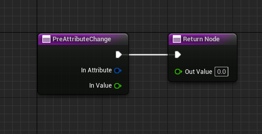
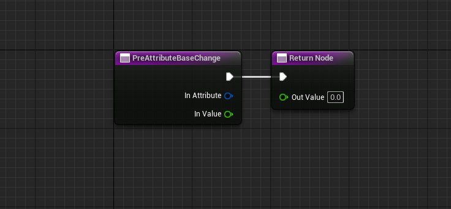
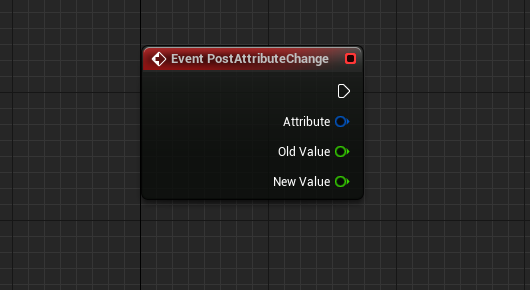
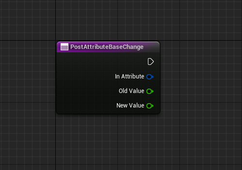
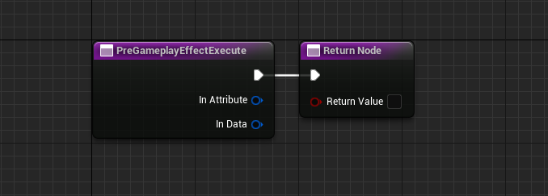
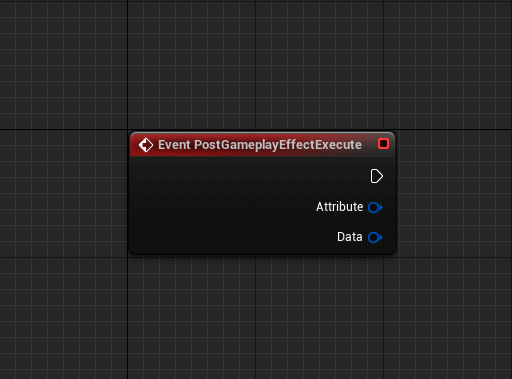
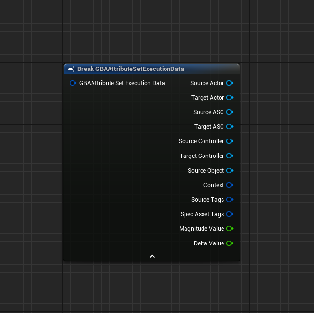

import { Callout } from 'nextra/components'
import { Tabs } from 'nextra/components'
import Zoom from 'react-medium-image-zoom'

# Interactions with Gameplay Effects

There are several functions that an Attribute Set can override to deal with the way an Attribute responds when a Gameplay Effect attempts to modify it.

Most of this API is exposed to Blueprints (PostGameplayEffectExecute, Pre/PostAttributeChange, ...).

## PreAttributeChange / PreAttributeBaseChange

They serve a similar purpose and share the same method signature.

One is invoked when the Current Value is modified, the other when the Base Value is changed.

<Callout type="default">
To learn more about BaseValue vs CurrentValue, check out `4.3.2` part of the most excellent [GASDocumentation on GitHub](https://github.com/tranek/GASDocumentation#concepts-a-value).

> Permanent changes to the BaseValue come from Instant GameplayEffects whereas Duration and Infinite GameplayEffects change the CurrentValue. Periodic GameplayEffects are treated like instant GameplayEffects and change the BaseValue.
</Callout>

### PreAttributeChange

<Zoom></Zoom>

**Method description**

Called just before any modification happens to an attribute. This is lower level than PreAttributeModify/PostAttribute modify.
 
There is no additional context provided here since anything can trigger this. Executed effects, duration based effects, effects being removed, immunity being applied, stacking rules changing, etc.
 
This function is meant to enforce things like "Health = Clamp(Health, 0, MaxHealth)" and NOT things like "trigger this extra thing if damage is applied, etc".
 
OutValue is a mutable reference so you are able to clamp the newly applied value as well

<Callout type="warning">
**Note** When overriding in BP, OutValue is the return value of the overriden BP function, make sure to pass in the new value. Typical implementation should simply return the input value parameter (or a clamped value based on InValue).
</Callout>

**Parameters**

| Name            | Type                        | Description |
| :-----          | :----                       | :----       |
| InAttribute     | const FGameplayAttribute&   | The Gameplay Attribute whose current (or final) value is about to change |
| InValue         | float                       | Original value for the Gameplay Attribute |
| OutValue        | float                       | Return value of the function which represents the new current value for the Gameplay Attribute |

### PreAttributeBaseChange

<Zoom></Zoom>

**Method description**

This is called just before any modification happens to an attribute's base value.

This function should enforce clamping (presuming you wish to clamp the base value along with the final value in PreAttributeChange)

This function should NOT invoke gameplay related events or callbacks. Do those in PreAttributeChange() which will be called prior to the
final value of the attribute actually changing.

**Parameters**

| Name            | Type                        | Description |
| :-----          | :----                       | :----       |
| InAttribute     | const FGameplayAttribute&   | The Gameplay Attribute whose base value is about to change |
| InValue         | float                       | Original value for the Gameplay Attribute |
| OutValue        | float                       | Return value of the function which represents the new base value for the Gameplay Attribute |

## PostAttributeChange / PostAttributeBaseChange

Similar pattern as previous section about Pre-hooks, they share similar pattern and method signature.

The only difference between the two is that `PostAttributeBaseChange` is const, whereas `PostAttributeChange` is not (making the latter an implementable Event - as opposed to a overriden BP function).

### PostAttributeChange

<Zoom></Zoom>

**Method description**

Called just after any modification happens to an attribute.

**Parameters**

| Name            | Type                        | Description |
| :-----          | :----                       | :----       |
| InAttribute     | const FGameplayAttribute&   | The Gameplay Attribute whose value has been changed |
| OldValue        | float                       | Original value for the Gameplay Attribute, before PreAttributeChange event and actual modification happened |
| NewValue        | float                       | New value for the Gameplay Attribute, after PreAttributeChange event and modification happened |

### PostAttributeBaseChange

<Zoom></Zoom>

**Method description**

Called just after any modification happens to an attribute's base value right and after aggregation (when an attribute aggregator exists).

**Parameters**

| Name            | Type                        | Description |
| :-----          | :----                       | :----       |
| InAttribute     | const FGameplayAttribute&   | The Gameplay Attribute whose base value has been changed |
| OldValue        | float                       | Original value for the Gameplay Attribute, before PreAttributeBaseChange event and actual modification happened |
| NewValue        | float                       | New value for the Gameplay Attribute, after PreAttributeBaseChange event and modification |

## PreGameplayEffectExecute

<Zoom></Zoom>

**Method description**

Called just before modifying the value of an attribute. AttributeSet can make additional modifications here.

Return true to continue, or false to throw out the modification

Note this is only called during an 'execute'. E.g., a modification to the 'base value' of an attribute.
It is not called during an application of a GameplayEffect, such as a 5 second +10 movement speed buff.

This should apply 'gamewide' rules. Such as clamping Health to MaxHealth or granting +3 health for every point of strength, etc
PreGameplayEffectExecute can return false to 'throw out' this modification.

<Callout type="warning">
**Note:** Be extra careful when overriding this function in BP, make sure to return true, otherwise the Gameplay Effects won't apply anymore.

Since the default behavior for the editor is to implement the method with return value set to false, this is something to be wary off.
</Callout>

**Parameters**

| Name            | Type                                  | Description                                               |
| :-----          | :----                                 | :----                                                     |
| InAttribute     | const FGameplayAttribute&             | The Gameplay Attribute whose base value has been changed  |
| InData          | [const FGBAAttributeSetExecutionData&](#related-struct-fgbaattributesetexecutiondata)  | Payload with information extracted from FGameplayEffectModCallbackData, the Source / Target actor, Ability System Component, Controllers, Effect Context, Specs and Source Tags, Magnitude and Delta values, etc. |

**Return value**

Return true to continue, or false to throw out the modification.

#### PostGameplayEffectExecute

<Zoom></Zoom>

**Method description**

Called just after a GameplayEffect is executed to modify the base value of an attribute. No more changes can be made.

Note this is only called during an 'execute'. E.g., a modification to the 'base value' of an attribute. It is not called during an application of a GameplayEffect, such as a 5 second +10 movement speed buff.

This should apply 'gamewide' rules. Such as clamping Health to MaxHealth or granting +3 health for every point of strength, etc

**Parameters**

| Name            | Type                                  | Description                                                               |
| :-----          | :----                                 | :----                                                                     |
| Attribute       | const FGameplayAttribute&             | The Gameplay Attribute whose value has been changed by a Gameplay Effect  |
| InData          | [const FGBAAttributeSetExecutionData&](#related-struct-fgbaattributesetexecutiondata)  | Payload with information extracted from FGameplayEffectModCallbackData, the Source / Target actor, Ability System Component, Controllers, Effect Context, Specs and Source Tags, Magnitude and Delta values, etc. |

## struct FGBAAttributeSetExecutionData

Structure holding various information to deal with AttributeSet lifecycle events (such as Pre/PostGameplayEffectExecute), extracting info from FGameplayEffectModCallbackData.

<Callout type="info">
This struct is used as an input parameter for some of the AttributeSet BP exposed event / methods that are using `FGameplayEffectModCallbackData` in native code ([PreGameplayEffectExecute](#pregameplayeffectexecute) and [PostGameplayEffectExecute](#postgameplayeffectexecute))
</Callout>

<Tabs items={['Blueprint', 'Members', 'Header']}>
  <Tabs.Tab>
    <Zoom></Zoom>
  </Tabs.Tab>
  <Tabs.Tab>
| Name              | Type                            | Description                                                               |
| :-----            | :----                           | :----                                                                     |
| SourceActor       | AActor*                         | The physical representation of the Source ASC (The ability system component of the instigator that started the whole chain)  |
| TargetActor       | AActor*                         | The physical representation of the owner (Avatar) for the target we intend to apply to |
| SourceASC         | UAbilitySystemComponent*        | The ability system component of the instigator that started the whole chain |
| TargetASC         | UAbilitySystemComponent*        | The ability system component we intend to apply to |
| SourceController  | APlayerController*              | PlayerController associated with the owning actor for the Source ASC (The ability system component of the instigator that started the whole chain) |
| TargetController  | APlayerController*              | PlayerController associated with the owning actor for the target we intend to apply to |
| SourceObject      | UObject*                        | The object this effect was created from |
| Context           | FGameplayEffectContextHandle    | This tells us how we got here (who / what applied us) |
| SourceTags        | FGameplayTagContainer           | Combination of spec and actor tags for the captured Source Tags on GameplayEffectSpec creation |
| SpecAssetTags     | FGameplayTagContainer           | All tags that apply to the gameplay effect spec |
| MagnitudeValue    | float                           | Holds the modifier magnitude value, if it is available (for scalable floats) |
| DeltaValue        | float                           | Holds the delta value between old and new, if it is available (for Additive Operations) |
  </Tabs.Tab>
  <Tabs.Tab>

```cpp
USTRUCT(BlueprintType)
struct BLUEPRINTATTRIBUTES_API FGBAAttributeSetExecutionData
{
	GENERATED_BODY()

	/** The physical representation of the Source ASC (The ability system component of the instigator that started the whole chain) */
	UPROPERTY(BlueprintReadOnly, Category = "Blueprint Attributes")
	TObjectPtr<AActor> SourceActor = nullptr;

	/** The physical representation of the owner (Avatar) for the target we intend to apply to  */
	UPROPERTY(BlueprintReadOnly, Category = "Blueprint Attributes")
	TObjectPtr<AActor> TargetActor = nullptr;

	/** The ability system component of the instigator that started the whole chain */
	UPROPERTY(BlueprintReadOnly, Category = "Blueprint Attributes")
	TObjectPtr<UAbilitySystemComponent> SourceASC = nullptr;

	/** The ability system component we intend to apply to */
	UPROPERTY(BlueprintReadOnly, Category = "Blueprint Attributes")
	TObjectPtr<UAbilitySystemComponent> TargetASC = nullptr;

	/** PlayerController associated with the owning actor for the Source ASC (The ability system component of the instigator that started the whole chain) */
	UPROPERTY(BlueprintReadOnly, Category = "Blueprint Attributes")
	TObjectPtr<APlayerController> SourceController = nullptr;

	/** PlayerController associated with the owning actor for the target we intend to apply to */
	UPROPERTY(BlueprintReadOnly, Category = "Blueprint Attributes")
	TObjectPtr<APlayerController> TargetController = nullptr;

	/** The object this effect was created from. */
	UPROPERTY(BlueprintReadOnly, Category = "Blueprint Attributes")
	TObjectPtr<UObject> SourceObject = nullptr;

	/** This tells us how we got here (who / what applied us) */
	UPROPERTY(BlueprintReadOnly, Category = "Blueprint Attributes")
	FGameplayEffectContextHandle Context;

	/** Combination of spec and actor tags for the captured Source Tags on GameplayEffectSpec creation */
	UPROPERTY(BlueprintReadOnly, Category = "Blueprint Attributes")
	FGameplayTagContainer SourceTags;

	/** All tags that apply to the gameplay effect spec */
	UPROPERTY(BlueprintReadOnly, Category = "Blueprint Attributes")
	FGameplayTagContainer SpecAssetTags;

	/** Holds the modifier magnitude value, if it is available (for scalable floats) */
	UPROPERTY(BlueprintReadOnly, Category = "Blueprint Attributes")
	float MagnitudeValue = 0.f;

	/** Holds the delta value between old and new, if it is available (for Additive Operations) */
	UPROPERTY(BlueprintReadOnly, Category = "Blueprint Attributes")
	float DeltaValue = 0.f;

	/** Default constructor */
	FGBAAttributeSetExecutionData() = default;

	/**
	 * Fills out FGBAAttributeSetExecutionData structure based on provided FGameplayEffectModCallbackData data.
	 *
	 * @param InModCallbackData The gameplay effect mod callback data available in attribute sets' Pre/PostGameplayEffectExecute
	 */
	explicit FGBAAttributeSetExecutionData(const FGameplayEffectModCallbackData& InModCallbackData);

	/** Returns a simple string representation for this structure */
	FString ToString(const FString& InSeparator = TEXT(", ")) const;
};
```

  </Tabs.Tab>
</Tabs>