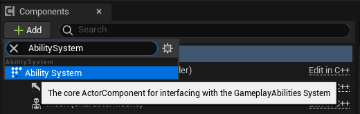
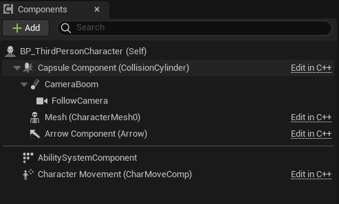
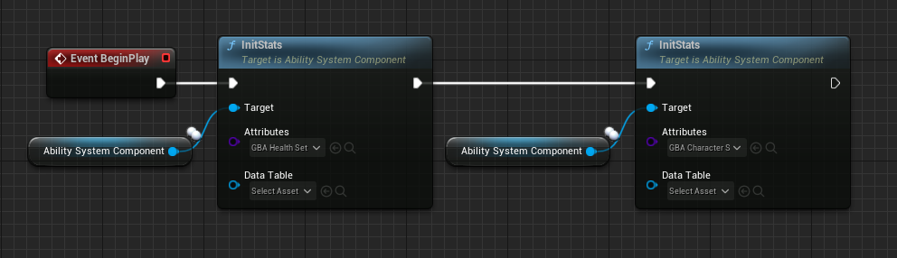
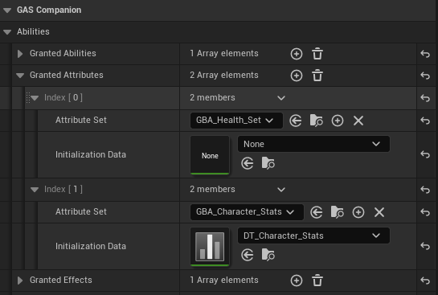

import { Callout } from 'nextra/components'

# Registering the Attribute Set with the ASC

Once you create an Attribute Set with one or more Gameplay Attributes, we need to register (or grant) it to the appropriate Ability System Component.

## Adding the ASC (Ability System Component)

<Callout type="info">
Adding the ASC to your Actors is usually done in C++ (and before engine 5.0, it was mandatory). For example in Lyra or using GAS Companion, you'd have this component created for you already. For the purpose of these instructions, we simply add the component in Blueprint and you can freely skip this step if this is applicable to you.
</Callout>

Add the actor component "Ability System" to your Character Blueprint, rename it to AbilitySystemComponent for good measure.

*In the components panel, click the "Add" button and search for "AbilitySystem".*

*Rename the component to "AbilitySystemComponent" (optional, but it'll keep it consistent as if it was added in C++)*

## Register Attribute Sets with the ASC

In the next sections, we are going to create Attribute Sets (in Blueprint!).

<Callout type="info">
The prefix used here for Blueprint Attribute Sets will be "GBA_", standing for Gameplay Blueprint Attributes. But you are free to choose the prefix for your project and name them as you please.
</Callout>

You will eventually have to register the Attribute Sets with the appropriate ASC for these Attributes to appear and have an impact in-game. You can do so with either:

1. OnBeginPlay and using the InitStats() method on the ASC (this is engine API)

2. You can also add the Attribute Set type to the ASC's Default Starting Data (in the details panel with ASC selected, again engine API). Keep in mind that for it to work, you need to provide both the Attribute Set type **and** a DefaultStartingTable DataTable (even if the latter is empty). This is the current engine implementation skipping initialization if the DataTable is not provided.

*Details panel with Ability System Component selected in the Blueprint Editor*

3.  A third method depends on your usual GAS backend. Be it Lyra / GAS Companion or you own implementation, they each have their own way of providing a list of Attributes to grant (conceptually similar to DefaultStartingData in 2.)
    1. With GAS Companion, you can for instance use the Granted Attributes array on the ASC or an Ability Set. In Lyra, you'll likely register Attribute Sets via a PawnData and an AbilitySet DataAsset.
    
    2. Or even,  if you use Game Features, via a GameFeature action (in GAS Companion or Lyra) and the Attributes list they both provide.
    

Here, we'll use the `InitStats()` engine method, as part of the ASC API, to grant the Attribute Set on Begin Play.

If we now test in-game and use the gameplay debugger, we can see the Attributes properly registered with our ASC and ready to use.

## Gameplay Debugger

Hit Play and launch the game in PIE, and open up the console command by pressing the backtick key <code className="nx-border-black nx-border-opacity-[0.04] nx-bg-opacity-[0.03] nx-bg-black nx-break-words nx-rounded-md nx-border nx-py-0.5 nx-px-[.25em] nx-text-[.9em] dark:nx-border-white/10 dark:nx-bg-white/10">\`</code> (normally located below the ESC key) on QWERTY keyboards or the `²` on AZERTY keyboards.

<Callout type="info">
You can customize this in `Project Settings > Engine > Input > Console > Console Keys`.
</Callout>

Then type `showdebug abilitysystem` in the console to display the Gameplay Debugger for Gameplay Abilities. You should in the first "Attributes" page the Attribute(s) we defined earlier.

You can also use the new `AbilitySystem.DebugAttribute` command.

Type `AbilitySystem.DebugAttribute Health` to add a little overlay for a simple display of desired attributes (you can pass a list of Attributes to display with a space separated list of Attribute names).

<Callout type="info">
- You can pass a list of Attributes to the command with a space separated list of Attribute names.
- Enter the command again to hide the overlay if it is visible (toggle behavior).
</Callout>