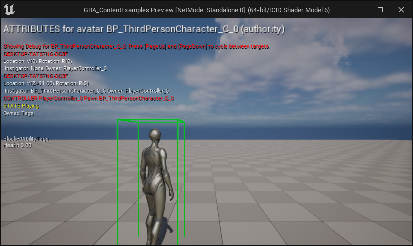
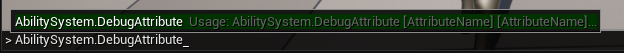
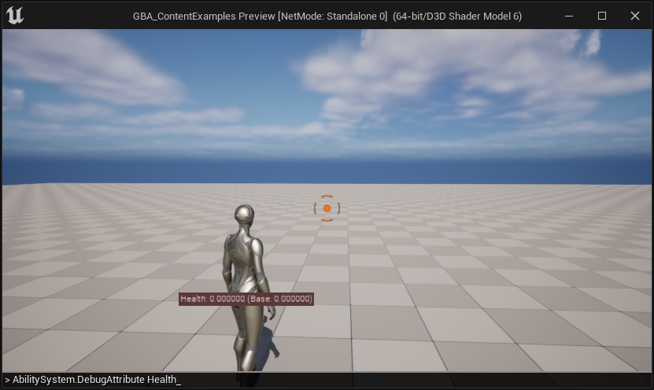

import { Callout } from 'nextra/components'

# Registering the Attribute Set with the ASC

Once you create an Attribute Set with one or more Gameplay Attributes, we need to register (or grant) it to the appropriate Ability System Component.

<Callout type="info">
You can refer to [Register Attribute Sets with the ASC](/docs/project-setup#register-attribute-sets-with-the-asc) for more options.
</Callout>

Here, we'll use the `InitStats()` engine method, as part of the ASC API, to grant the Attribute Set on Begin Play.

If we know test in-game and use the gameplay debugger, we can see the Attributes properly registered with our ASC and ready to use.

## Gameplay Debugger

Hit Play and launch the game in PIE, and open up the console command by pressing the backtick key <code className="nx-border-black nx-border-opacity-[0.04] nx-bg-opacity-[0.03] nx-bg-black nx-break-words nx-rounded-md nx-border nx-py-0.5 nx-px-[.25em] nx-text-[.9em] dark:nx-border-white/10 dark:nx-bg-white/10">\`</code> (normally located below the ESC key) on QWERTY keyboards or the `²` on AZERTY keyboards.

<Callout type="info">
You can customize this in `Project Settings > Engine > Input > Console > Console Keys`.
</Callout>

Then type `showdebug abilitysystem` in the console to display the Gameplay Debugger for Gameplay Abilities. You should in the first "Attributes" page the Attribute(s) we defined earlier.

You can also use the new `AbilitySystem.DebugAttribute` command.

Type `AbilitySystem.DebugAttribute Health` to add a little overlay for a simple display of desired attributes (you can pass a list of Attributes to display with a space separated list of Attribute names).

<Callout type="info">
- You can pass a list of Attributes to the command with a space separated list of Attribute names.
- Enter the command again to hide the overlay if it is visible (toggle behavior).
</Callout>