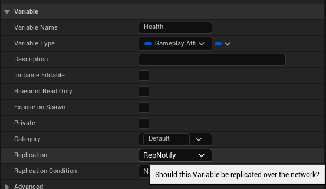
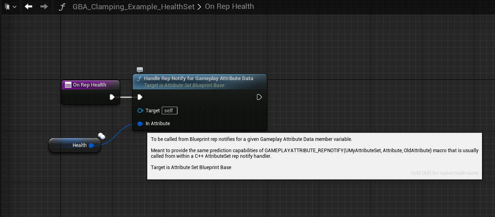
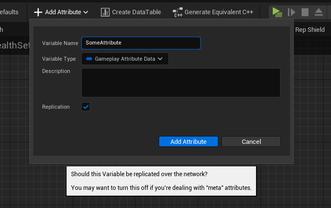
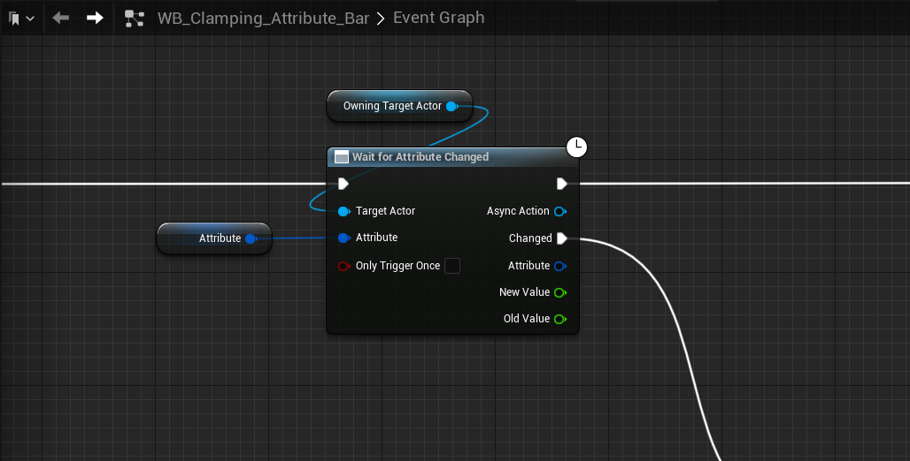
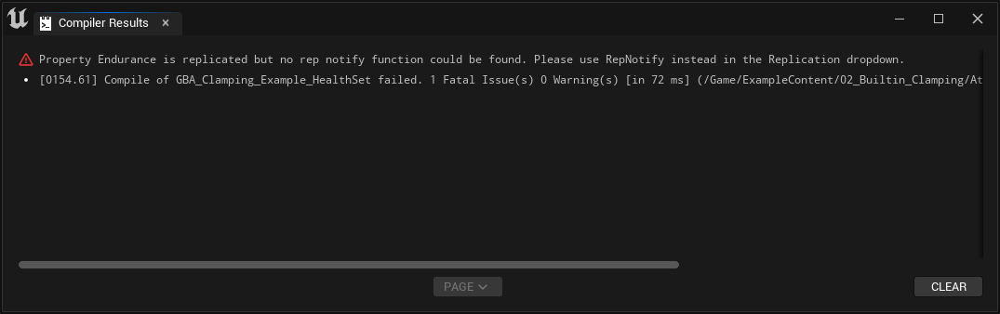
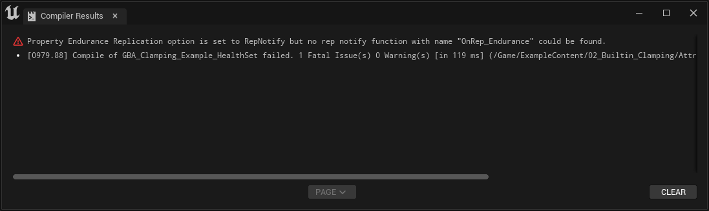
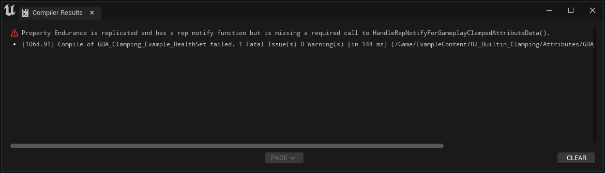
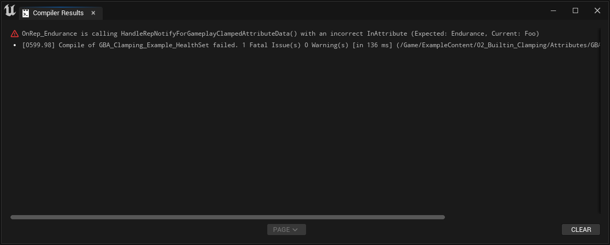

import Zoom from 'react-medium-image-zoom'
import { Callout } from 'nextra/components'
import { Video } from '../../../components/docs/Video'

# Replication

For multiplayer projects, you can replicate your Gameplay Attribute defined in Blueprints similar to how you would replicate any other property, with some requirements to use rep notifies and call a specific function within them.

## GetLifetimeReplicatedProps

`GetLifetimeReplicatedProps()` is implemented in `UGBAAttributeSetBlueprintBase (Attribute Set Blueprint Base)`, the UAttributeSet runtime class Blueprint AttributeSet are inheriting from.

It's using the same pattern as Actor Replication or Actor Components, which is going through `UBlueprintGeneratedClass::GetLifetimeBlueprintReplicationList()` to collects all FProperties (Blueprint variables) that are marked for replication.

## Rep Notifies

Using rep notifies, you can handle attributes that will be predictively modified by clients. In Blueprints, that means using `RepNotify` for the replication option and calling `HandleRepNotifyForGameplayAttributeData()` within the corresponding RepNotify function implementation.

*Make sure you're using RepNotify for the Replication option*
<Zoom>

</Zoom>


(Blueprint equivalent of C++ GAMEPLAYATTRIBUTE_REPNOTIFY helper macro).

*Make sure you're calling `HandleRepNotifyForGameplayAttributeData()` within the Rep Notify function graph*
<Zoom>

</Zoom>

<Callout type="default">
If the Attribute Data property is a [clamped property](/docs/attribute-sets/built-in-clamping#with-gameplay-clamped-attribute-data-properties) of type `FGBAGameplayClampedAttributeData`, the handler method to call is `HandleRepNotifyForGameplayClampedAttributeData()`.
</Callout>

The "Add Attribute" button available in the toolbar or in the Class Defaults panel can be used to automate the creation of replicated properties.

*If the replication checkbox is checked, the created Attribute property will use `RepNotify` for its replication option, and the corresponding rep notify function will be created for you with the required call to `HandleRepNotifyForGameplayAttributeData()`*
<Zoom>

</Zoom>

### Why it's important

You'll find that using simply `Replicated` without a rep notify (or using RepNotify but without calling `HandleRepNotifyForGameplayAttributeData()` or in C++ the equivalent `GAMEPLAYATTRIBUTE_REPNOTIFY` helper macro) for the Attribute property will work for most of the Attribute functionnality (eg. Attribute modification via Gameplay Effects replicate properly).

But one noticeable issue arise with Gameplay Attribute Changes delegates, that Ability or Async tasks uses internally.

```cpp
ASC->GetGameplayAttributeValueChangeDelegate(Attribute);
```

`UAbilityAsync_WaitAttributeChanged` and `UAbilityTask_WaitAttributeChangeThreshold` are two engine examples where it's used.

If the Attribute is set to replicate, but doesn't notify the Ability System of the predictive change, you'll find the delegate for attribute changes doesn't fire properly anymore in a networked environment.

<Video src="/videos/attribute_rep_notify_01.mp4">
*First video with correct replication option and rep notify*
</Video>

<Video src="/videos/attribute_rep_notify_02.mp4">
*Second video with incorrect replication option (only Replicated), or with a Rep Notify that omits the call to `HandleRepNotifyForGameplayAttributeData()`.*
</Video>

Notice how the Attribute values still replicates (the Overlay debug widget with `AbilitySystem.DebugAttribute`) but the Progress Bars of the UMG fell out of sync (UMG that is using internally `Wait For Attribute Changed` async task).

<Zoom>

</Zoom>

<Callout type="info">
This demonstration setup can be found in the [Content Examples project](/docs/resources/content-examples-project) in the `02_Builtin_Clamping` map. The UMG responsible for the Attributes progress bars is `WB_Clamping_Attribute_Bar`.
</Callout>

## Data Validation

We went through how important it is in a networked environment to setup the Attributes properly, and how error-prone it could be. That's why it's important to create the Blueprint AttributeSet using the Asset Actions and Factory the plugin provides (using the Content Browser context menu).

This will ensure:

* The parent class is set to the appropriate one (`UGBAAttributeSetBlueprintBase`, namely for `GetLifetimeReplicatedProps()` implementation and to gain access to the [BP exposed events / functions](/docs/attribute-sets/interactions-with-gameplay-effects) and [helper methods](/docs/attribute-sets/helper-methods))
* Blueprints are using `FGBABlueprintEditor` for their asset editor.

Besides the custom toolbar, the Blueprint Attribute Set Editor has one key role: Data Validation.

### Validation Rules

In this section, we are going to go through each of the Validation rules, related to replicated Attribute properties, the plugin implements via both `UGBAAttributeSetBlueprintBase (Attribute Set Blueprint Base)` (runtime class to use for Blueprint parent class, child class of `UAttributeSet`) and `FGBABlueprintEditor` (The editor class that implements a custom `FBlueprintEditor | FAssetEditorToolkit`)

The rules are as follow:

1. All attribute replicated properties must use RepNotify for their replication option

<Zoom>

</Zoom>

2. Checks all attribute replicated are implementing the corresponding rep notify function

<Zoom>

</Zoom>

3. Checks all rep notify functions for an attribute are using `HandleRepNotifyForGameplayAttribute()` (and is wired in to the execution pin)

<Zoom>

</Zoom>

4. It is using the correct FGameplayAttributeData property for its parameter (name of the rep notified and the InAttribute property should match)

<Zoom>

</Zoom>