import Zoom from 'react-medium-image-zoom'
import { Callout } from 'nextra/components'
import { Video } from '../../components/docs/Video'
import { FolderIcon } from '@heroicons/react/24/solid'
import { Cog8ToothIcon } from '@heroicons/react/24/solid'


## Overview

The Attribute Wizard and Scaffold module is a major feature of Blueprint Attributes. This document aims to go through its usage.

It's goal is to ease the process of transitioning Attributes defined in Blueprints (for instance, when the prototyping phase is done for a new gameplay mechanic) to C++.

## Open Attribute Wizard Window

You can bring up the Wizard Window from within the Content Browser, or from within the Blueprint Attributes Editor window.

*From Content Browser, right click a `Gameplay Blueprint AttributeSet` asset and choose "Preview Equivalent C++ Header"*
<Zoom>
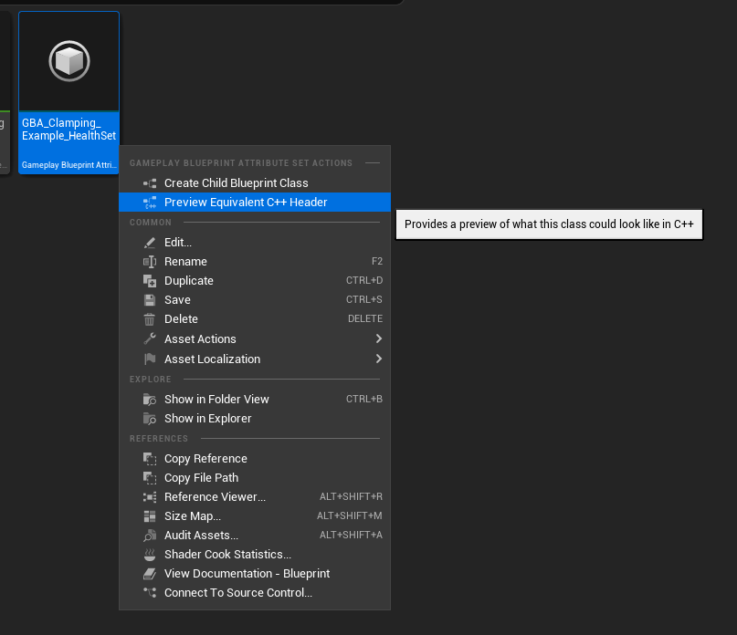
</Zoom>

*From within a Blueprint AttributeSet asset editor, click on "Generate Equivalent C++" in the toolbar*
<Zoom>
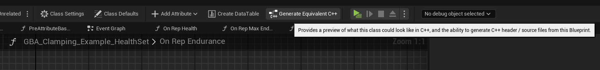
</Zoom>

You'll be granted with the following window:

<Zoom>
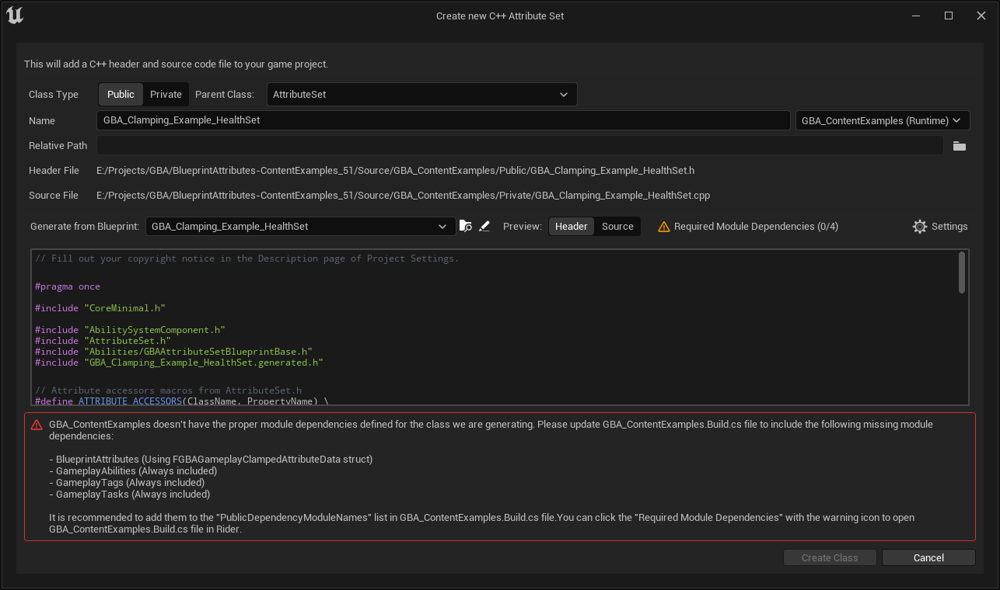
</Zoom>

## Required Module Dependencies

The first thing to take care of is proper module dependencies for the target Module we are going to generate the C++ class into, and you'll likely only need to do it once (if you always generate in the same module).

You can choose the target C++ module with the combo box located right to the Name field. The first value is always the primary Game module, but if you'd like to have the AttributeSet C++ class generated in one of your Runtime plugin (installed in Project's Plugins/ folder), you can pick one of its module here.

<Zoom>
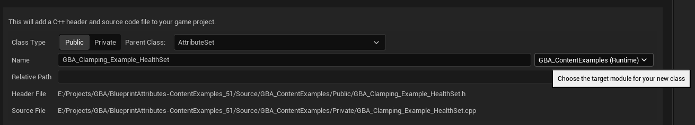
</Zoom>

If your target module Build.cs file doesn't define required module dependencies, the Wizard will complain and tell which modules are missing. It is important to setup properly to ensure we don't get compilation errors later on.

You should see a warning "Required Module Dependencies" right above the preview window, and a longer explanation below the preview.

<Zoom>
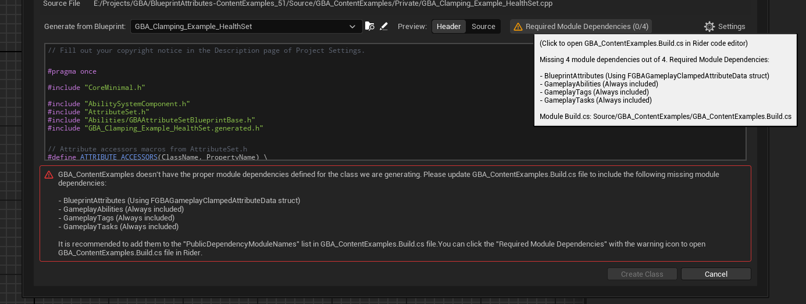
</Zoom>

You can click the "Required Module Dependencies" button to open the Build.cs file for the selected module using your configured code editor (in Editor Settings > General > Source Code).

You'll then need to add each of the missing module dependency in either Public or Private module dependencies for the Build.cs file (depending on whether you generate the C++ header in a Public or Private folder, the Class Type Public or Private option)

<Video src="/videos/attribute_wizard_01.mp4">
`GBA_ContentExamples` Runtime module is missing a few module dependencies, let's fix that.
</Video>

We need to add the following modules:

- `GameplayAbilities`
- `GameplayTags`
- `GameplayTasks`
- `BlueprintAttributes` (because one of the Attributes is using a Clamped property - for `FGBAGameplayClampedAttributeData`)

Upon saving the module Build.cs file, the Wizard window should update and eventually all the warning and error output should be gone.

<Callout type="warning">
Keep in mind, the plugin only check if the Build.cs file matches each of the require module, meaning it only check if it contains "GameplayAbilities" for instance. It doesn't check if it's properly defined in the correct `PublicDependencyModuleNames` or `PrivateDependencyModuleNames` list or if it is commented out.

```cs
PublicDependencyModuleNames.AddRange(new string[]
{
  "Core",
  "CoreUObject",
  "Engine",
  "InputCore",
  
  // "GameplayAbilities",
  "GameplayTags",
  "GameplayTasks",
  
  "BlueprintAttributes"
});
```
</Callout>

Now, the Wizard window shouldn't have any warning or errors and should look like the following:

<Zoom>
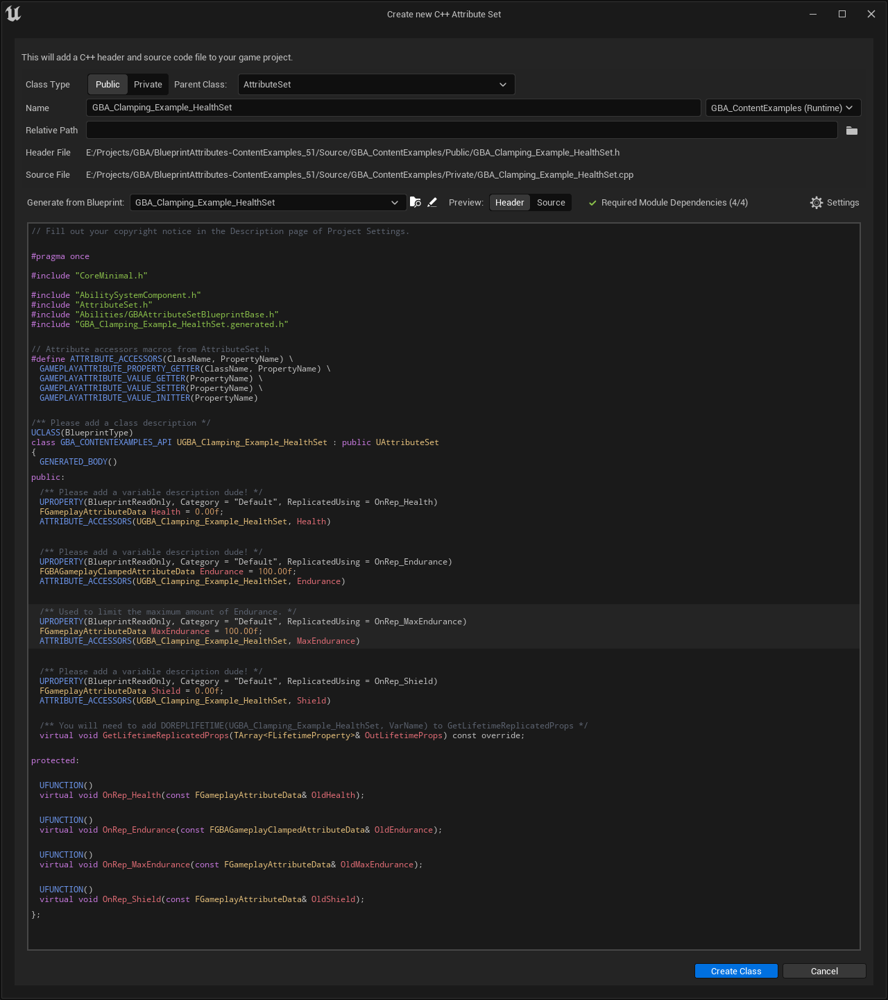
</Zoom>

## Attribute Wizard Fields

### Class Type

The `Class Type` option is the first field, and lets you choose whether you want the C++ header to be generated within a Public/ folder, or alongside the .cpp file in the Private/ folder.

If you wish other modules to be able to access the C++ AttributeSet, then using `Public` is recommended.

The nice thing about the preview window is that it will dynamically update whenever any relevant field is changed.

In this case, a `Public` class type will generate the `MODULENAME_API` dll export macro, while if choosing `Private` it is not needing anymore and won't be included with the header class definition.

<Zoom>
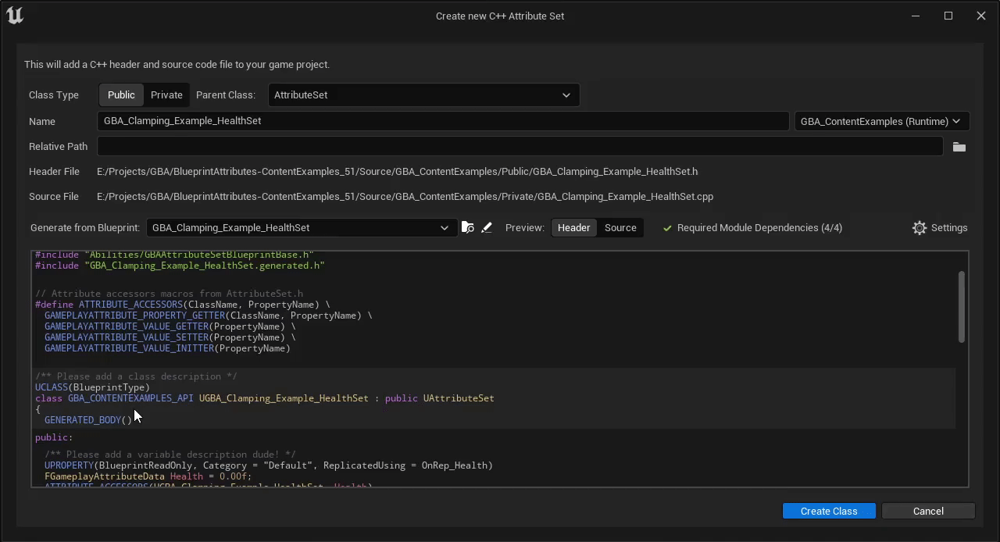
</Zoom>

If we switch the preview to Source, the other part that changes depending on CLass Type is the include path for the header, if we have a relative sub path.

<Zoom>
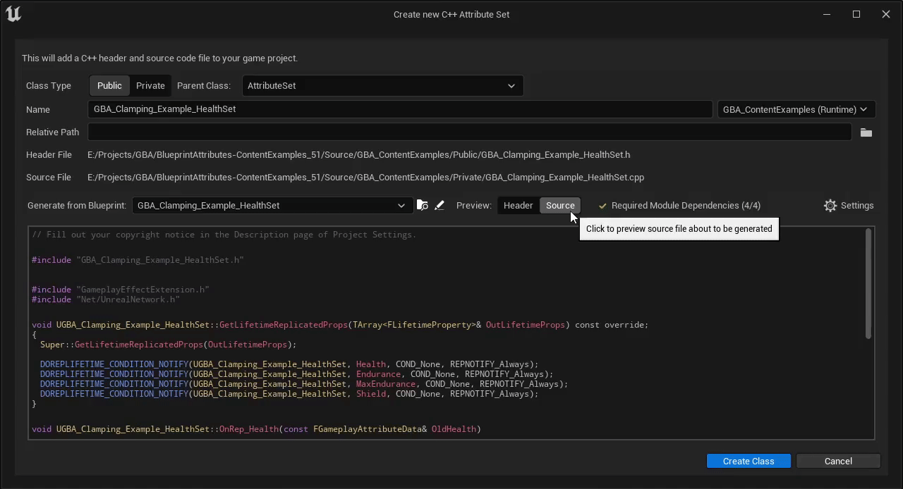
</Zoom>

### Parent Class

The second field is the `Parent Class`, this lets you choose a specific Attribute Set base class to inherit from.

<Zoom>
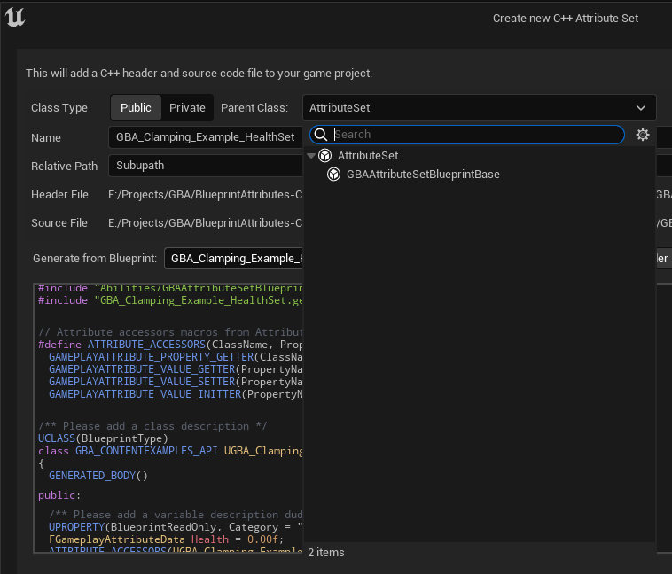
</Zoom>

The combo box should list all the AttributeSet subclass available in the project, and the default value is simply `UAttributeSet` which is the recommended class to use.

You can choose `GBAAttributeSetBlueprintBase` if you wish to maintain the ability to use the [BP exposed events and methods](/docs/attribute-sets/interactions-with-gameplay-effects) in Blueprints (while having the actual FGameplayAttribute properties defined in C++).

### Name

The next field is `Name` text box, that lets you customize the C++ classname and resulting header / source file names. It is by default the same as the .uasset name of the original Blueprint AttributeSet we opened the wizard from.

<Zoom>
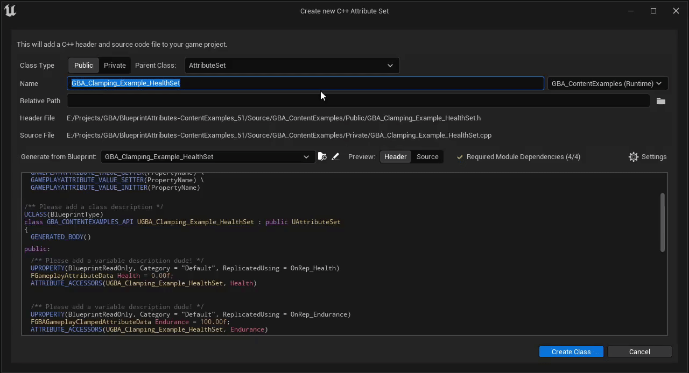
</Zoom>

### Target Module

Next to the `Name` textbox, the `Target Module` combo box lets you pick a different module for the C++ generated class. By default, it is set to the Game module and is the first entry in the combo box.

<Zoom>
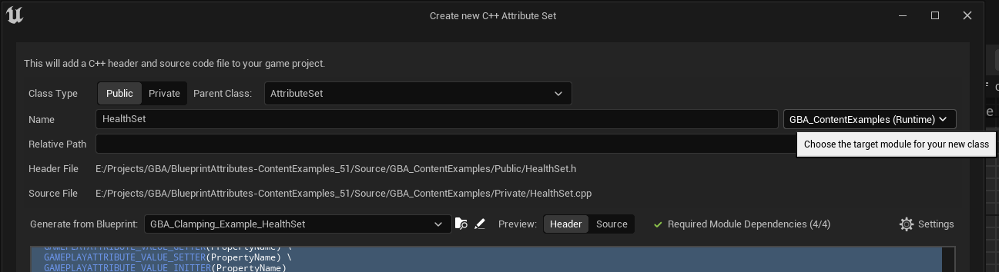
</Zoom>

It'll change the Header and Source file paths on selection (and is directly related to [Required Module Dependencies](/docs/attribute-wizard#required-module-dependencies)).

### Relative Path

`Relative Path` text field lets you change the relative path beneath the target module source path.

<Zoom>
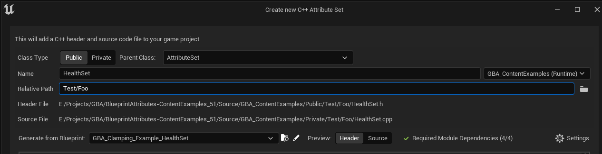
</Zoom>

You can click the little <FolderIcon height="16px" width="16px" className="inline" /> next to the text box to open the OS Directory Dialog and pick a different location (must be within the target module source path).

### Header / Source files

Those two read-only fields are changed whenever `Name`, `Target Module`, or `Relative Path` are changed.

### Generate From Blueprint

The `Generate From Blueprint` combo box field lets you pick a different Blueprint AttributeSet. It is by default the original Blueprint AttributeSet asset for which the Wizard was first opened.

<Zoom>
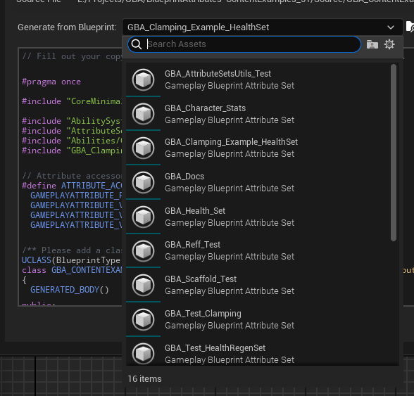
</Zoom>

Don't forget to change the `Name` field appropriately if you change this value.

The preview window will be updated accordingly upon choosing a new Blueprint here.

### Preview: Header / Source

This group of buttons lets you change the preview window just below, to either preview the Header or Source file that is going to be generated when the `Create Class` button is clicked.

### Settings <Cog8ToothIcon height="24px" className="inline" />

The <Cog8ToothIcon height="16px" className="inline" /> `Settings` button can be used to adjust a variety of config options related to the preview window. You can change syntax highlighting colors here, or the font size.

Those settings are the same as `Blueprint Attributes > Scaffold Preview Settings` and can be accessed via the Editor Preferences window as well.

<Zoom>
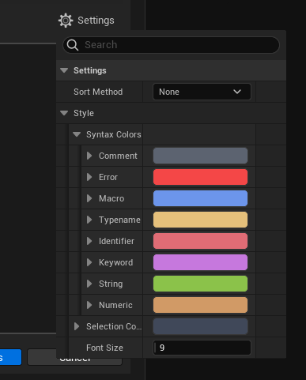
</Zoom>