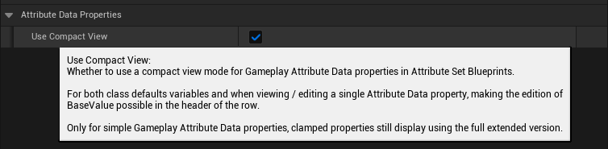
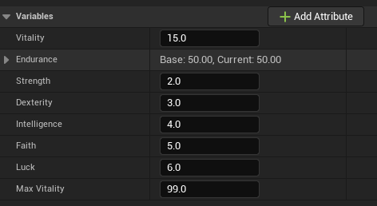
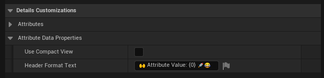

import Zoom from 'react-medium-image-zoom'

# Blueprint Attributes Editor

Upon first opening, the Blueprint Editor will look like this.

<Zoom>

</Zoom>

A few additional buttons can be found in the toolbar, next to the PIE and Debugging controls.

We will go over each of these buttons shortly.

### Creating a new Attribute

#### Add Attribute Button

But first let's click on the "Add Attribute" button.

This combo button brings up a new panel with a form and a few inputs to help with the creation of new Gameplay Attribute properties.

- The type can be either FGameplayAttributeData or FGBAGameplayClampedAttributeData (FGameplayAttributeData with built-in clamping features)
- The Replication checkbox can be used if the Attribute needs to be replicated, and will generate the appropriate Rep_Notify function and implementation.

It's a quicker and less error-prone way of creating a new Gameplay Attribute variable, by enforcing proper types and saving a few clicks / manual steps.

You should now have a newly created Gameplay Attribute variable, with type FGameplayAttributeData.

Along with an "OnRep_Health" function (the rep notify) if you checked the Replication checkbox.

#### Attribute Details

With the Health variable selected, the Detail panel should look like this.

The important part that is customized by the plugin is the Default Value panel, where you can see the Base and Current value of the Attribute, and change its default value directly from within the Blueprint Editor (courtesy of one of our Details customization class, FGBAGameplayAttributeDataDetails).

#### Rep Notify

if you checked the Replication checbox, a rep notify function should be implemented for you, with the required call to HandleRepNotifyForGameplayAttribute().

The main role of HandleRepNotifyForGameplayAttribute() is to handle attributes that will be predictively modified by clients, something that is usually done with GAMEPLAYATTRIBUTE_REPNOTIFY helper macro in C++.

### Class Defaults

Now that we have at least one variable created, we can take a look at the Details panel for the Class Defaults (by clicking on this button in the toolbar)

It is adding a new "Add Attribute" button (same function as the one in the toolbar) and listing each and every BP variables. The Gameplay Attribute Data properties are then displayed like here, providing you a simple way to see and tweak all your Attributes at once and their default values.

Here is an example with an Attribute Set and more Gameplay Attributes.

#### Details Settings

You can customize that part of the Editor with few Details Customization option in the Project Settings.

Open up the Project Settings, then scroll down to the bottom of the sidebar. You should see a "Blueprint Attributes" section where all the configurable settings for the Plugin can be found.

<Zoom>

</Zoom>

**Use Compact View**

If you turn on Compact View mode in the Project Settings, Details for Gameplay Attributes Data properties will be simplified and use a simplified display.

For both class defaults variables and when viewing / editing a single Attribute Data property, making the edition of BaseValue possible in the header of the row.

Only for simple Gameplay Attribute Data properties, clamped properties still display using the full extended version (like the Endurance Attribute above, we'll go over Gameplay Clamped Attribute properties in their own section)

**Header Format Text**

The other relevant setting is "Header Format Text".

Customize how the header row is displayed and what should be included. This is a FText::Format format string, with two floats being passed in as an argument (BaseValue and CurrentValue). Both float values are converted to String with "%.2f" to reduce precision to only two decimals (Default Value: `"Base: {0}, Current: {1}"`)

You could even get fancy and use [utf8 emojis](https://quickref.me/emoji.html) in there 😉

