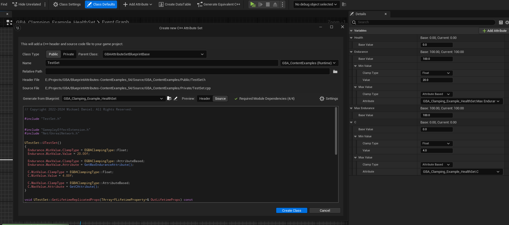

import Zoom from 'react-medium-image-zoom'

## [1.1.1](https://github.com/BlueprintAttributes/BlueprintAttributes/releases/tag/1.1.1) - Jan 18, 2025

**Bug Fixes**

* fix: handle attribute renames / removed in 5.5 in [#119](changelog/pull/119)

Specific to 5.5 (5.3 and 5.4 not changed) with better handling of attribute renames and added handling of attribute removal.

**Full Changelog**: [https://github.com/BlueprintAttributes/BlueprintAttributes/compare/1.1.0...1.1.1](https://github.com/BlueprintAttributes/BlueprintAttributes/compare/1.1.0...1.1.1)

  
## [1.1.0](https://github.com/BlueprintAttributes/BlueprintAttributes/releases/tag/1.1.0) - Nov 22, 2024

**New Features**

* Attribute Wizard: Handle clamped properties definitions during wizard generation in [#116](changelog/pull/116) - Fix [#113](changelog/issue/113)

<Zoom>

</Zoom>

**Bug Fixes**

* Attribute Wizard: Fix issue with FGBAGameplayClampedAttributeData by removing explicit constructor - Fix [#112](changelog/issue/112)
* Prevent crash upon using AttributeData in an Owner class that is not an UAttributeSet (In a struct, for instance) in [#117](changelog/pull/117)
* Fix dedicated servers build with BlueprintAttributesDeveloper module, moving `BlueprintGraph` and `BlueprintAttributesEditor` dependencies to be included only for editor target.

**Full Changelog**: [https://github.com/BlueprintAttributes/BlueprintAttributes/compare/1.0.4...1.1.0](https://github.com/BlueprintAttributes/BlueprintAttributes/compare/1.0.4...1.1.0)

  
## [1.0.4](https://github.com/BlueprintAttributes/BlueprintAttributes/releases/tag/1.0.4) - Oct 26, 2024

**Other Changes**

* Few fixes for 5.5 compatibility in [#115](changelog/pull/115)

**Full Changelog**: [https://github.com/BlueprintAttributes/BlueprintAttributes/compare/1.0.3...1.0.4](https://github.com/BlueprintAttributes/BlueprintAttributes/compare/1.0.3...1.0.4)

  
## [1.0.3](https://github.com/BlueprintAttributes/BlueprintAttributes/releases/tag/1.0.3) - Jun 26, 2024

**Bug Fixes**

* Add REPLICATED\_BASE\_CLASS to AttributeSet base class, preventing crash from happening on projects with push model enabled. in [#106](changelog/pull/106)
* Fixed Base / Current attribute values change propagation to child classes and better support for reset to default value in [#104](changelog/pull/104)

**Full Changelog**: [https://github.com/BlueprintAttributes/BlueprintAttributes/compare/1.0.2...1.0.3](https://github.com/BlueprintAttributes/BlueprintAttributes/compare/1.0.2...1.0.3)

  
## [1.0.2](https://github.com/BlueprintAttributes/BlueprintAttributes/releases/tag/1.0.2) - Apr 7, 2024

**Other Changes**

* Fix: Ensure GEditor exists before accessing UGBAEditorSubsystem in [#101](changelog/pull/101)

**Full Changelog**: [https://github.com/BlueprintAttributes/BlueprintAttributes/compare/1.0.1...1.0.2](https://github.com/BlueprintAttributes/BlueprintAttributes/compare/1.0.1...1.0.2)

  
## [1.0.1](https://github.com/BlueprintAttributes/BlueprintAttributes/releases/tag/1.0.1) - Apr 3, 2024

**Other Changes**

* Minor fixes for 5.4 engine in [#100](changelog/pull/100)

**Full Changelog**: [https://github.com/BlueprintAttributes/BlueprintAttributes/compare/1.0.0...1.0.1](https://github.com/BlueprintAttributes/BlueprintAttributes/compare/1.0.0...1.0.1)

  
## [1.0.0](https://github.com/BlueprintAttributes/BlueprintAttributes/releases/tag/1.0.0) - Mar 18, 2024

**Other Changes**

* Tweak .uplugin description, update Resources/Icon128.png in [#96](changelog/pull/96)

**Full Changelog**: [https://github.com/BlueprintAttributes/BlueprintAttributes/compare/0.8.0...1.0.0](https://github.com/BlueprintAttributes/BlueprintAttributes/compare/0.8.0...1.0.0)

  
## [0.8.0](https://github.com/BlueprintAttributes/BlueprintAttributes/releases/tag/0.8.0) - Mar 10, 2024

* Ensure Config/ directory is included in packages [ca03d15](https://github.com/BlueprintAttributes/BlueprintAttributes/commit/ca03d15095b603aa15900185fe51ebf8eea68972)

**Full Changelog**: [https://github.com/BlueprintAttributes/BlueprintAttributes/compare/0.7.0...0.8.0](https://github.com/BlueprintAttributes/BlueprintAttributes/compare/0.7.0...0.8.0)

  
## [0.7.0](https://github.com/BlueprintAttributes/BlueprintAttributes/releases/tag/0.7.0) - Mar 10, 2024

**Other Changes**

* Preparation for technical review checklist in [#93](changelog/pull/93)

**Full Changelog**: [https://github.com/BlueprintAttributes/BlueprintAttributes/compare/0.6.0...0.7.0](https://github.com/BlueprintAttributes/BlueprintAttributes/compare/0.6.0...0.7.0)

  
## [0.6.0](https://github.com/BlueprintAttributes/BlueprintAttributes/releases/tag/0.6.0) - Mar 9, 2024

**Other Changes**

* Editor: Handle case of BP only project for wizard in [#92](changelog/pull/92)

**Full Changelog**: [https://github.com/BlueprintAttributes/BlueprintAttributes/compare/0.5.0...0.6.0](https://github.com/BlueprintAttributes/BlueprintAttributes/compare/0.5.0...0.6.0)

  
## [0.5.0](https://github.com/BlueprintAttributes/BlueprintAttributes/releases/tag/0.5.0) - Mar 5, 2024

**Other Changes**

* Fix CI release workflow in [#84](changelog/pull/84)
* Replace default icons in [`2e68b1a`](https://github.com/BlueprintAttributes/BlueprintAttributes/commit/2e68b1aa79292350537a5a722d2d5f59dbd87a49)
* Tweak .uplugin in [`9af40be`](https://github.com/BlueprintAttributes/BlueprintAttributes/commit/9af40beb5121a5f5970d1e825950cb0b40750090)
  * Set category to Gameplay (Testing for tests plugin)
  * Add Docs and SupportURL
  * Remove beta / experimental flags

**Full Changelog**: [https://github.com/BlueprintAttributes/BlueprintAttributes/compare/0.4.0...0.5.0](https://github.com/BlueprintAttributes/BlueprintAttributes/compare/0.4.0...0.5.0)

  
## [0.4.0](https://github.com/BlueprintAttributes/BlueprintAttributes/releases/tag/0.4.0) - Mar 3, 2024

**Other Changes**

* Fix clamping on initialization in [#72](changelog/pull/72)
* Initial set of BP helpers for Exec Calculations support in Blueprints in [#78](changelog/pull/78)
* CI: Rework linux workflow in [#80](changelog/pull/80)
* CI: Adding a new workflow to sync Test plugin to BlueprintAttributes/BlueprintAttributesTests repository in [#82](changelog/pull/82)
* WIP work and experiment on SaveGame support in [#81](changelog/pull/81)
* Runtime: Flesh out serialization API in [#83](changelog/pull/83)

**Full Changelog**: [https://github.com/BlueprintAttributes/BlueprintAttributes/compare/0.3.0...0.4.0](https://github.com/BlueprintAttributes/BlueprintAttributes/compare/0.3.0...0.4.0)

  
## [0.3.0](https://github.com/BlueprintAttributes/BlueprintAttributes/releases/tag/0.3.0) - Oct 27, 2023

**Other Changes**

* Wip in [#62](changelog/pull/62)
  * Mainly ensures 5.3 packaging.
  * Also fixes non unity build for 5.1 and 5.2. 5.3 has weird errors in non unity about engine not able to include some of its internal files.

* Wip 2 in [#63](changelog/pull/63)

* Docs in [#64](changelog/pull/64)
  * HandleRepNotifyForGameplayAttributeData now works out of property directly (not an FName anymore)
  * New Slate Window (only accessible via `GBA.Test` command for now) to test ReferencerViewer on Attributes in 5.3
  * Few tweaks in class / method descriptions
  * GetAttributeValue now returns a bool indicating if the Attribute was found (and now using UAbilitySystemBlueprint internally)
  * UGBAAttributeSetBlueprintBase is now Blueprintable (remove NotBlueprintable from UCLASS), related to Attribute Wizard and ability to reparent prev Blueprint to generated C++ class.
    * TODO: Might split the class in two
  * Removed old docs folder
  * New `Documentation/` folder with website
    * Most docs page done, remains TODO:
      * Further docs / check on Attribute Wizard doc - Instructions on how to replace old Attribute references
      * Referencer handler documentation TODO

**Full Changelog**: [https://github.com/BlueprintAttributes/BlueprintAttributes/compare/0.2.0...0.3.0](https://github.com/BlueprintAttributes/BlueprintAttributes/compare/0.2.0...0.3.0)

  
## [0.2.0](https://github.com/BlueprintAttributes/BlueprintAttributes/releases/tag/0.2.0) - Jan 30, 2023

**Bug Fixes**

* Fix: Rename handling doesn't happen on newly created Attribute Set BP in [#61](changelog/pull/61)

**Full Changelog**: [https://github.com/GASCompanion/BlueprintAttributes/compare/0.1.0...0.2.0](https://github.com/GASCompanion/BlueprintAttributes/compare/0.1.0...0.2.0)

  
## [0.1.0](https://github.com/BlueprintAttributes/BlueprintAttributes/releases/tag/0.1.0) - Jan 28, 2023

* Refactor renames
* Fix rename crash
* Kick in automated testing
* Add `Switch on Gameplay Attribute` node and `GetDebugStringFromAttribute()`
* Adding built-in clamping methods
* Added first generation of API docs and setup astro for it
* Refactor plugin rename
* Expand BP exposed API for Attribute Sets
* Scaffolding Module
* Add attribute button from Attribute Set class defaults (or editor toolbar)
* fix: Preload UGBAAttributeSetBlueprint before generating Attributes picker
* Convert to TObjectPtr and fix all resharper inspection warnings / suggestions / hints
* Add dev settings and FilterAttributesList
* Adds new DataTable widget and button to Blueprint Editor toolbar
* Add Details customization to change FGameplayAttributeData BaseValue in details panel
* Fix core redirects / UGBABlueprintLibrary::GetAttributeDisplayNameText() / Debug map
* Fix inspection warnings
* Add Attribute: Handle Enter Key on text commit
* Scaffold follow up
* Clamping follow up
* HandleRepNotifyForGameplayAttribute() able to determine old attribute data
* Feat rename attribute
* Editor: Fix message log link to navigate to effect referencer

  
---

Updated Jan 18, 2025
