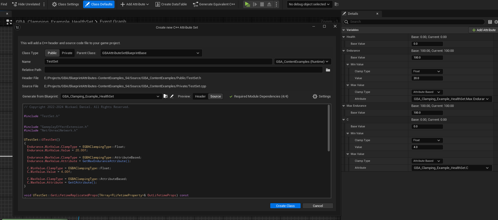

*[on November 21st, 2024](https://github.com/BlueprintAttributes/BlueprintAttributes/pull/116)*

## Editor: Handle clamped properties definitions during wizard generation

Adds constructor to generated classes

and definitions for clamped properties, if the parent class picked is of type UGBAAttributeSetBlueprintBase

FGBAGameplayClampedAttributeData handling requires logic in PostGameplayEffectExecute handled by UGBAAttributeSetBlueprintBase

In case clamped properties are present, and parent class is UAttributeSet (or not child of UGBAAttributeSetBlueprintBase), the generated AttributeSet class will use standard FGameplayAttributeData and convert type from FGBAGameplayClampedAttributeData to FGameplayAttributeData.

Fixes [#113](https://github.com/BlueprintAttributes/BlueprintAttributes/issues/113)

