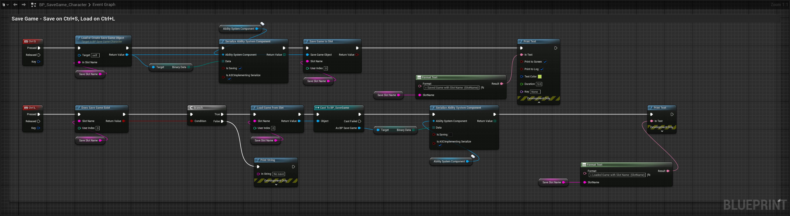

import Zoom from 'react-medium-image-zoom'

*[on March 3rd, 2024](https://github.com/BlueprintAttributes/BlueprintAttributes/pull/83)*

## Runtime: Flesh out serialization API

* Moving serialization logic out of AttributeSet into FGBAUtils static lib
* Adding FGBAUtils::SerializeAbilitySystemComponentAttributes serialization helper (meant to be used from within an ASC overriding Serialize())
* Refactored UGBASerializationBlueprintLibrary to implement saving / loading in the same method

## Usage

### Blueprint

<Zoom>

</Zoom>
<Zoom>

</Zoom>
<Zoom>

</Zoom>

