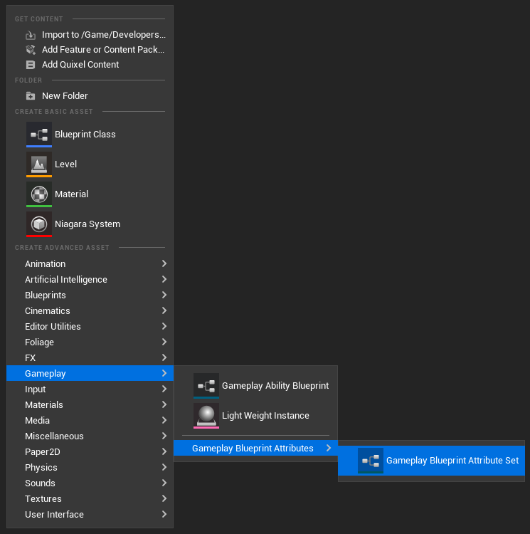

import { Callout } from 'nextra/components'

# Create a Blueprint Attribute Set

First thing first, we need to create the Blueprint for our Attribute Set. To do so, right click in the Content Browser and click on:

`Gameplay > Gameplay Blueprint Attributes > Gameplay Blueprint Attribute Set`

The prefix used here for Blueprint Attribute Sets will be "GBA_", standing for Gameplay Blueprint Attributes.

We're going to implement a simple AttributeSet to hold a Health variable: GBA_Health_Set

<Callout type="default">
It is highly recommended to always use the Context Menu asset action to create new Blueprint Attribute Sets.
</Callout>

Doing so will ensure the Blueprint is using a specific UBlueprint (UGBAAttributeSetBlueprint) and a customized BlueprintEditor (FGBABlueprintEditor). We will go over briefly each of its features.