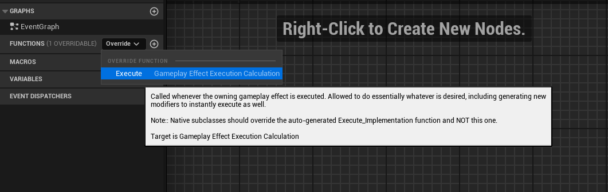
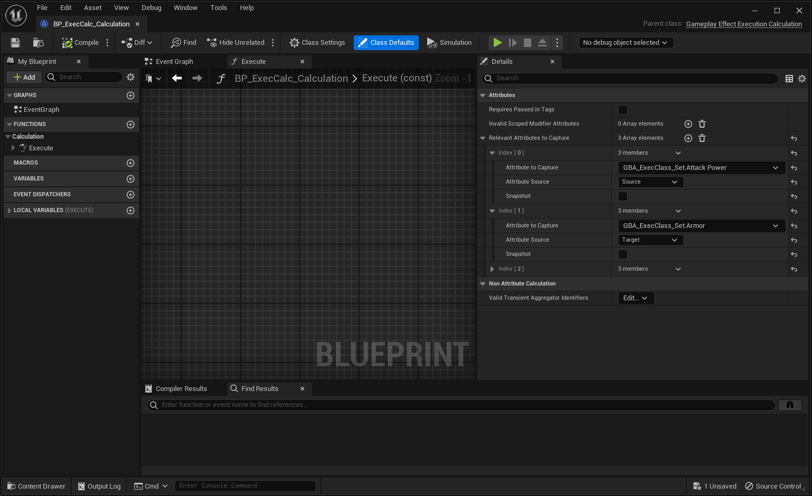
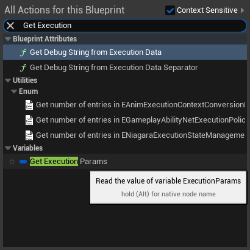
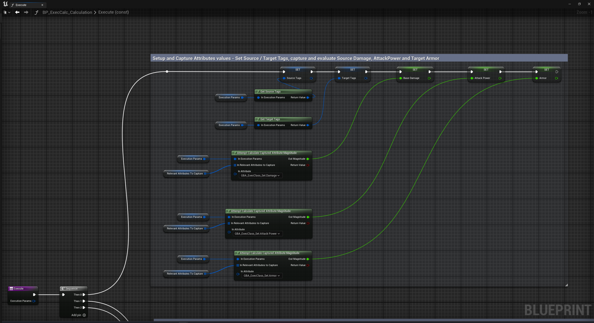
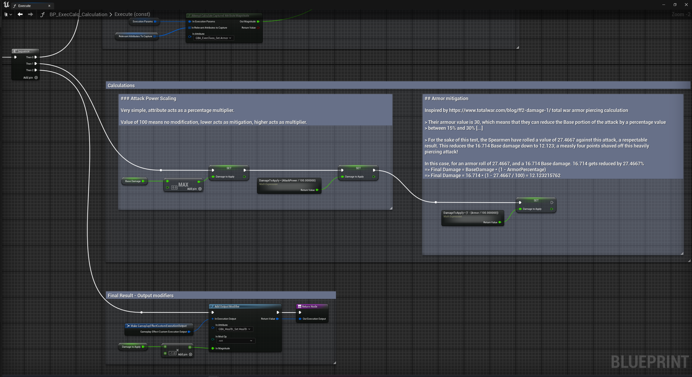
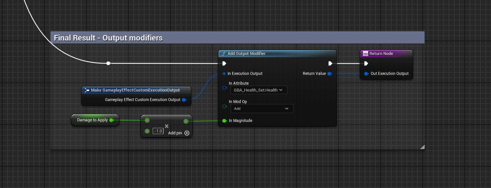
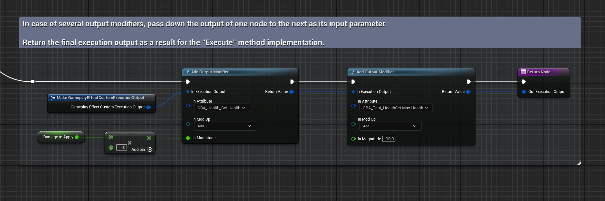

import Zoom from 'react-medium-image-zoom'
import { Callout } from 'nextra/components'

<Callout type="default">
This page is a work in progress
</Callout>

## Gameplay Effect Execution Calculation

<Callout type="info">
**Related** https://github.com/tranek/GASDocumentation#concepts-ge-ec
</Callout>

### Requirements

Blueprint parent class needs to be `UGameplayEffectExecutionCalculation`.

Override the functions `Execute`, the equivalent of the `Execute_Implementation.` when done in C++.

<Zoom>

</Zoom>

Make sure to edit the `Relevant Attributes to Capture` in Class Defaults, with all the Attributes your calculation will need. You can tweak this array as you go depending on the implementation of your execution.

<Zoom>

</Zoom>

### Calculation

Blueprint Attributes defines a few Blueprint statics (eg. methods from within a Blueprint Library globally accessible) to help in the implementation, namely:

- GetOwningSpec()
- GetEffectContext()
- GetSourceTags()
- GetTargetTags()
- AttemptCalculateCapturedAttributeMagnitude()
  - For this to work correctly, the Attribute needs to be added to the Relevant Attributes to Capture array.
- AttemptCalculateCapturedAttributeMagnitudeWithBase()
  - For this to work correctly, the Attribute needs to be added to the Relevant Attributes to Capture array.
- AddOutputModifier()

They all take as an input parameter the original `FGameplayEffectCustomExecutionParameters` structure that is passed down to the `Execute` method as an input parameter. Since it's a method (and not an event in the main event graph), feel free to leverage the fact it is a local variable to help in reducing wires throughout the event graph for your method.

Simply type `Get Execution Params` anywhere in the method event graph to access it.

<Zoom>

</Zoom>

By default, `UGameplayEffectExecutionCalculation` is Blueprintable but doesn't define any Blueprint exposed methods or helpers to actually base the entire calculation logic purely in Blueprint. Those few custom methods were designed to help implementing Exec Calc classes in Blueprints.

They can work off Attributes defined in either C++ or within Blueprint AttributeSets (GBA prefixed in this sample).

## Example

1. Capture Source / Target tags and relevant Attributes (don't forget to add them to the Relevant Attributes to Capture prop in class defaults)

<Zoom>

</Zoom>

`SourceTags`, `TargetTags`, `BaseDamage`, `AttackPower`, `Armor` are all local variables.

2. Do the calculation (based on info gathered in step 1.)

<Zoom>

</Zoom>

3. Add any number of output modifiers and return the Execution Output.

<Zoom>

</Zoom>

These output modifiers don't necessarily need to be captured as Relevant Attributes.

Make sure to return the result Execution Output.

If you want to output more than one modifier, you can do so by chaining the calls and passing down the Execution Output of one modifier to the next.

The first one will have to `Make GameplayEffectCustomExecutionOutput` the initial structure.

<Zoom>

</Zoom>