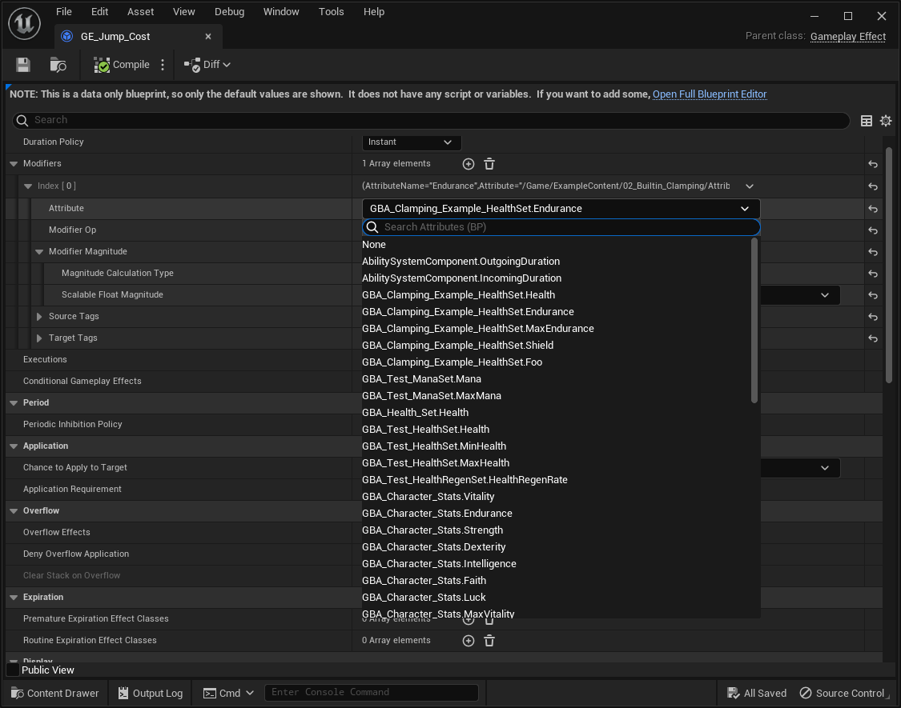
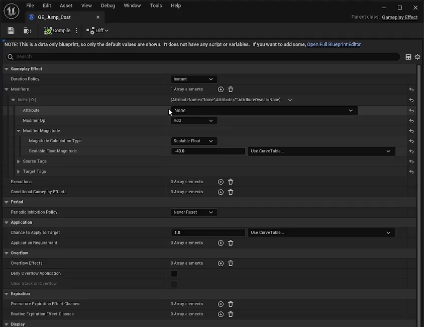
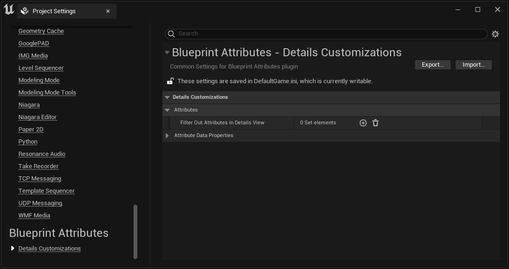

import Zoom from 'react-medium-image-zoom'
import { Callout } from 'nextra/components'
import { Video } from '../../components/docs/Video'

# Gameplay Effects

Gameplay Effects don't change. They still function the same with Blueprint Attributes plugin. This document aims to go through the few subtle differences and settings related to Gameplay Effects details customizations.

## Gameplay Attribute Dropdown

The dropdown available in the Modifiers array, or anywhere else a FGameplayAttribute property appear, is strictly identical to the engine default customization.

The main difference consists of allowing the display of FGameplayAttribute FProperties defined in the Blueprints, alongside the standard ones defined in C++, within the Attribute picker dropdown.

### Blueprint and C++ Attributes

*All `GBA_` prefixed Attribute Sets are Blueprints with FGameplayAttributeData properties.*
<Zoom>

</Zoom>

### Gain focus on filter search box

The other subtle difference is related to gaining focus immediately on the search box upon opening the combo box for the Attribute Picker.

<Callout type="info">
This is now a default behavior in 5.3, but this wasn't the case in previous engine versions.
</Callout>

*You can immediately start typing to filter attributes when the attribute combo box is opened.*
<Zoom>

</Zoom>

### Filter Attributes

Blueprint Attributes plugin provides the option to setup Attribute Filters in the Project Settings. It will allow you to hide and prevent specific Attributes from showing up in the Gameplay Attribute Picker.

Open up the Project Settings, and scroll down the left sidebar all the way down, until you see the "Blueprint Attributes" section, just below "Plugins".

You can then expand the `Details Customization > Attributes` category to find the `Filter Out Attributes in Details View` setting.

<Zoom>

</Zoom>

This is a simple list of FStrings, allowing you to define a list of gameplay attributes to ignore in attributes picker widget.
	 
Allows you to filter out a list of gameplay attributes from Attribute Sets in Gameplay Effects Blueprint or any Blueprint nodes listing them (such as with `GetFloatAttribute()` node)
	 
It can be useful if your project is never using pre-defined Attributes (such as AbilitySystemComponent.OutgoingDuration / IncomingDuration), or plugins (such as GAS Companion GSCAttributeSet).
	 
This is a StartsWith search pattern, meaning any value here should be the beginning of an attribute (or set) we'd like to ignore, for example:
	 
- AbilitySystemComponent
- AbilitySystemComponent.OutgoingDuration
- AbilitySystemComponent.IncomingDuration
- GSCAttributeSet
- GSCAttributeSet.Mana

<Video src="/videos/ge_filter_attributes_02.mp4" />
