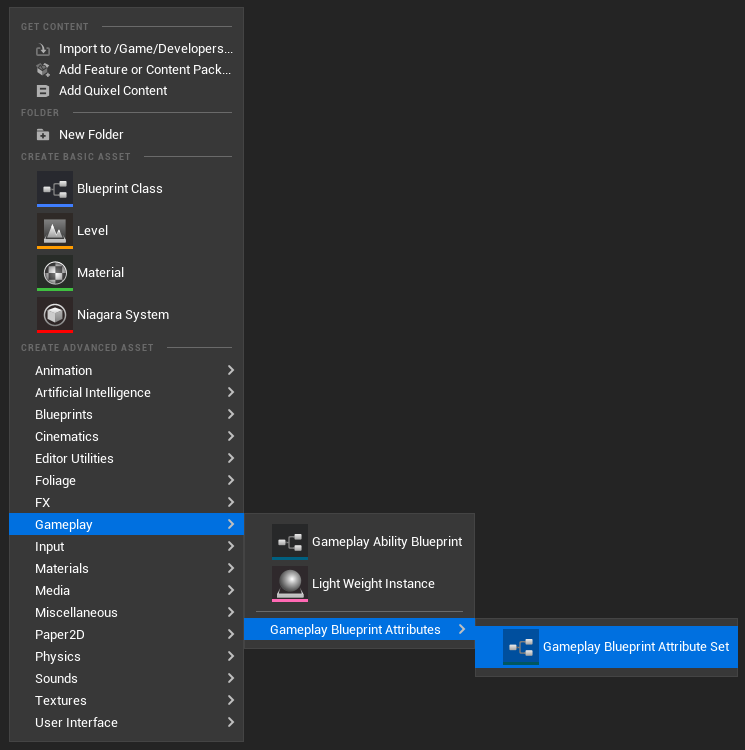
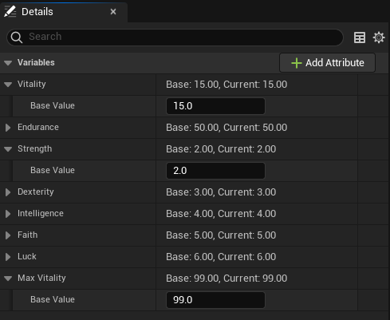
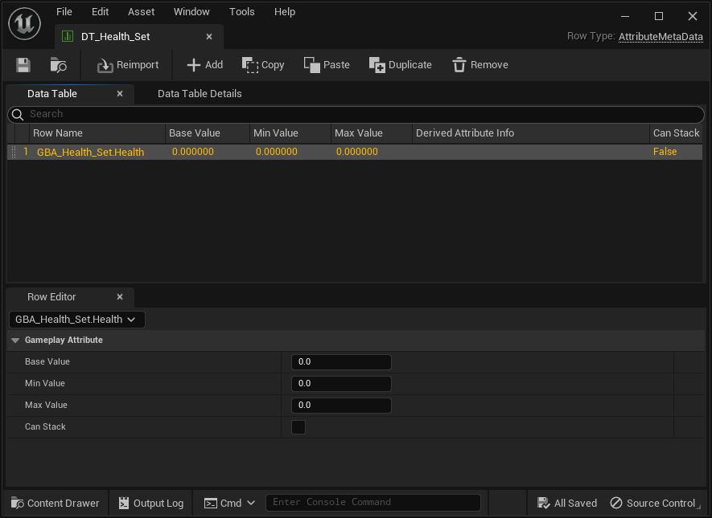

import { Callout } from 'nextra/components'


# Getting started

## Create a Blueprint Attribute Set

First thing first, we need to create the Blueprint for our Attribute Set. To do so, right click in the Content Browser and click on:

`Gameplay > Gameplay Blueprint Attributes > Gameplay Blueprint Attribute Set`



The prefix used here for Blueprint Attribute Sets will be "GBA_", standing for Gameplay Blueprint Attributes.

We're going to implement a simple AttributeSet to hold a Health variable: GBA_Health_Set


<Callout type="default">
It is highly recommended to always use the Context Menu asset action to create new Blueprint Attribute Sets.
</Callout>

Doing so will ensure the Blueprint is using a specific UBlueprint (UGBAAttributeSetBlueprint) and a customized BlueprintEditor (FGBABlueprintEditor). We will go over briefly each of its features.

## Blueprint Attributes Editor

Upon first opening, the Blueprint Editor will look like this.


A few additional buttons can be found in the toolbar, next to the PIE and Debugging controls.


We will go over each of these buttons shortly.

### Creating a new Attribute

#### Add Attribute Button

But first let's click on the "Add Attribute" button.


This combo button brings up a new panel with a form and a few inputs to help with the creation of new Gameplay Attribute properties.

- The type can be either FGameplayAttributeData or FGBAGameplayClampedAttributeData (FGameplayAttributeData with built-in clamping features)
- The Replication checkbox can be used if the Attribute needs to be replicated, and will generate the appropriate Rep_Notify function and implementation.


It's a quicker and less error-prone way of creating a new Gameplay Attribute variable, by enforcing proper types and saving a few clicks / manual steps.

You should now have a newly created Gameplay Attribute variable, with type FGameplayAttributeData.


Along with an "OnRep_Health" function (the rep notify) if you checked the Replication checkbox.

#### Attribute Details

With the Health variable selected, the Detail panel should look like this.


The important part that is customized by the plugin is the Default Value panel, where you can see the Base and Current value of the Attribute, and change its default value directly from within the Blueprint Editor (courtesy of one of our Details customization class, FGBAGameplayAttributeDataDetails).

#### Rep Notify

if you checked the Replication checbox, a rep notify function should be implemented for you, with the required call to HandleRepNotifyForGameplayAttribute().


The main role of HandleRepNotifyForGameplayAttribute() is to handle attributes that will be predictively modified by clients, something that is usually done with GAMEPLAYATTRIBUTE_REPNOTIFY helper macro in C++.

### Class Defaults

Now that we have at least one variable created, we can take a look at the Details panel for the Class Defaults (by clicking on this button in the toolbar)


It is adding a new "Add Attribute" button (same function as the one in the toolbar) and listing each and every BP variables. The Gameplay Attribute Data properties are then displayed like here, providing you a simple way to see and tweak all your Attributes at once and their default values.


Here is an example with an Attribute Set and more Gameplay Attributes.



#### Details Settings

You can customize that part of the Editor with few Details Customization option in the Project Settings.


If you turn on Compact View mode in the Project Settings, Details for Gameplay Attributes Data properties will be simplified and use this display.


For both class defaults variables and when viewing / editing a single Attribute Data property, making the edition of BaseValue possible in the header of the row.


Only for simple Gameplay Attribute Data properties, clamped properties still display using the full extended version (like the Endurance Attribute above, we'll go over Gameplay Clamped Attribute properties in their own section)

## Attribute Sets

### Registering the Attribute Set with the ASC

Once you create an Attribute Set with one or more Gameplay Attributes, we need to register (or grant) it to the appropriate Ability System Component.

<Callout type="info">
You can refer to [Register Attribute Sets with the ASC](/docs/project-setup#register-attribute-sets-with-the-asc) for more options.
</Callout>

Here, we'll use the `InitStats()` engine method, as part of the ASC API, to grant the Attribute Set on Begin Play.


If we know test in-game and use the gameplay debugger, we can see the Attributes properly registered with our ASC and ready to use.

#### Gameplay Debugger

Hit Play and launch the game in PIE, and open up the console command by pressing the backtick key <code class="nx-border-black nx-border-opacity-[0.04] nx-bg-opacity-[0.03] nx-bg-black nx-break-words nx-rounded-md nx-border nx-py-0.5 nx-px-[.25em] nx-text-[.9em] dark:nx-border-white/10 dark:nx-bg-white/10">\`</code> (normally located below the ESC key) on QWERTY keyboards or the `²` on AZERTY keyboards.

<Callout type="info">
You can customize this in `Project Settings > Engine > Input > Console > Console Keys`.
</Callout>

Then type `showdebug abilitysystem` in the console to display the Gameplay Debugger for Gameplay Abilities. You should in the first "Attributes" page the Attribute(s) we defined earlier.


You can also use the new `AbilitySystem.DebugAttribute` command.


Type `AbilitySystem.DebugAttribute Health` to add a little overlay for a simple display of desired attributes (you can pass a list of Attributes to display with a space separated list of Attribute names).


<Callout type="info">
- You can pass a list of Attributes to the command with a space separated list of Attribute names.
- Enter the command again to hide the overlay if it is visible (toggle behavior).
</Callout>

### Initialization

In this section, we'll talk about the various ways we have to initialize the Attribute values (the Base Value).

#### Initializing Attributes

This is a good time to talk about a Blueprint Attributes plugin specific feature. If you select the Gameplay Attribute property in the Blueprint Editor, or click on the "Class Defaults" button in the toolbar, you'll be able to change the default Attribute value directly from within the Details Panel.

Set it to an arbitrary value, for example `100`.


<Callout type="info">
This is normally not an exposed value, and not editable in the Details panel, but an Editor Details customization of Blueprint Attributes plugin is taking care of exposing that to Blueprints.
</Callout>

This is the equivalent in C++ of setting a Gameplay Attribute default value via its constructor in an AttributeSet header:

```cpp
UPROPERTY(BlueprintReadOnly, Category = "Attributes", ReplicatedUsing = OnRep_Health)
FGameplayAttributeData Health = 0.0f;
```

If we now launch the game in PIE and use the Gameplay Debugger commands, we should see the Attribute with its new default value:


#### Data Tables

Another popular way to initialize attributes beyond their default value, and further specialize Gameplay Attributes value based on the Actor (and ASC) it belongs, is through the use of Data Table.

Both the `InitStats()` method of the ASC and its Default Starting Data property (more infos and options in [Register Attribute Sets with the ASC](/docs/project-setup#register-attribute-sets-with-the-asc)) accepts an additional Data Table and a Gameplay Ability System row type called `AttributeMetaData`.

##### Creating the Data Table

###### Manually

<Callout type="default">
**Hint**: The next section explains how to do this automatically 😉
</Callout>

You can create `AttributeMetaData` Data Tables the usual way, by right-clicking in the Content Browser, and clicking on `Miscellaneous > Data Table` (or importing from an external .csv file).

In the "Pick Row Structure" dialog that appears, choose `AttributeMetaData` for the row type.

You have the option to add extra rows to support Attribute Sets with multiple Gameplay Attributes. In the file shown below, the "Health" Gameplay Attribute within GBA_Health_Set Blueprint will initialize with a value of 1000.

The syntax for the row name is `AttributeClassName.AttributeName` (without the "U" prefix for C++ defined Attribute Set, and without the "_C" suffix for Blueprint defined Attribute Set).



###### Automatically

The Blueprint Attributes Editor Toolbar provides an additional "Create DataTable" button to quickly create an initialization `AttributeMetaData` Data Table, based on the defined Gameplay Attributes in the Blueprint Editor.

It'll generate additional rows for each defined Attributes, with their Base Value set accordingly.

If you click on the "Create DataTable" button, you'll get the following window:


If you click on "Save" next, a new DataTable asset with the appropriate row type and content generated based on your defined attributes will be created.

- The path for the DataTable is by default next to the Attribute Set Blueprint it originates from, but you can tweak this with the left panel and Tree View.
- The name for the DataTable is by default `DT_{AttributeBlueprintName}` (for instance for a Blueprint `GBA_Health_Set`, the default name for the DataTable will be `DT_GBA_Health_Set`). You can change the name of the DataTable asset in the `Name` input field.

Here is an example for a Blueprint AttributeSet with slightly more Gameplay Attributes, and their BaseValue slightly modified:


And here is the resulting DataTable:


### Built-in Clamping

#### Via DataTable

#### With Gameplay Clamped Attribute Data properties

### Interactions with Gameplay Effects

#### PreAttributeChange / PreAttributeBaseChange

#### PostAttributeChange / PostAttributeBaseChange

#### PreGameplayEffectExecute

#### PostGameplayEffectExecute

```json
{
  "PreAttributeChange": "PreAttributeChange / PreAttributeBaseChange",
  "PostAttributeChange": "PostAttributeChange / PostAttributeBaseChange",
  "PreGameplayEffectExecute": "PreGameplayEffectExecute",
  "PostGameplayEffectExecute": "PostGameplayEffectExecute"
}
```

### Helper Methods

#### GetAttributeValue()

#### SetAttributeValue()

#### ClampAttributeValue()

### Replication

## Gameplay Effects