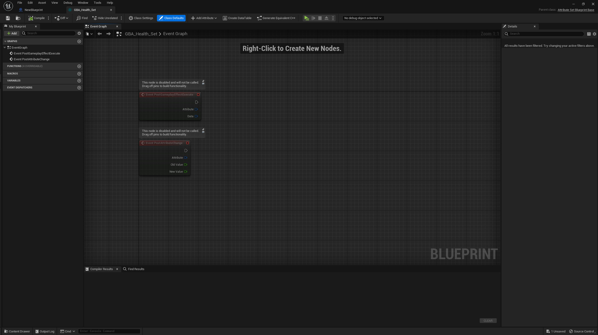
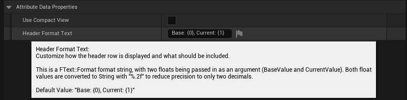
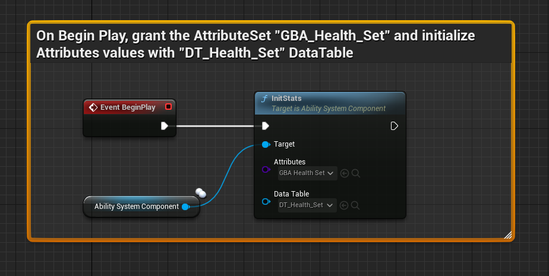
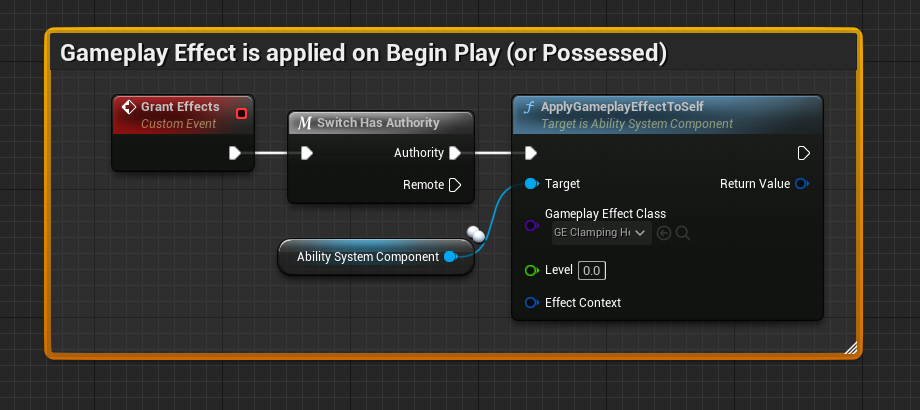
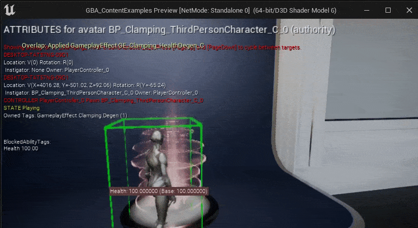
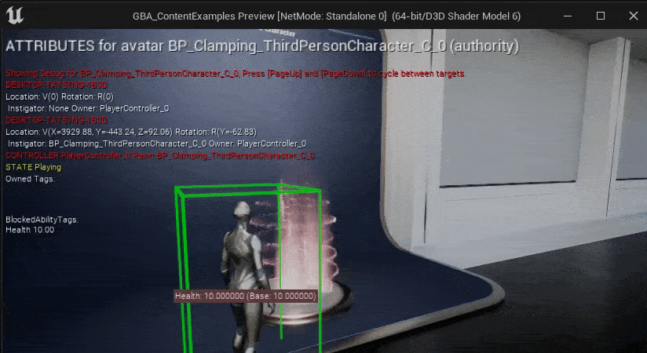
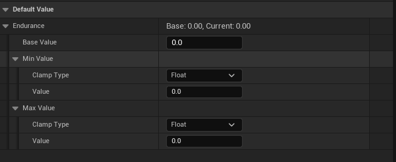
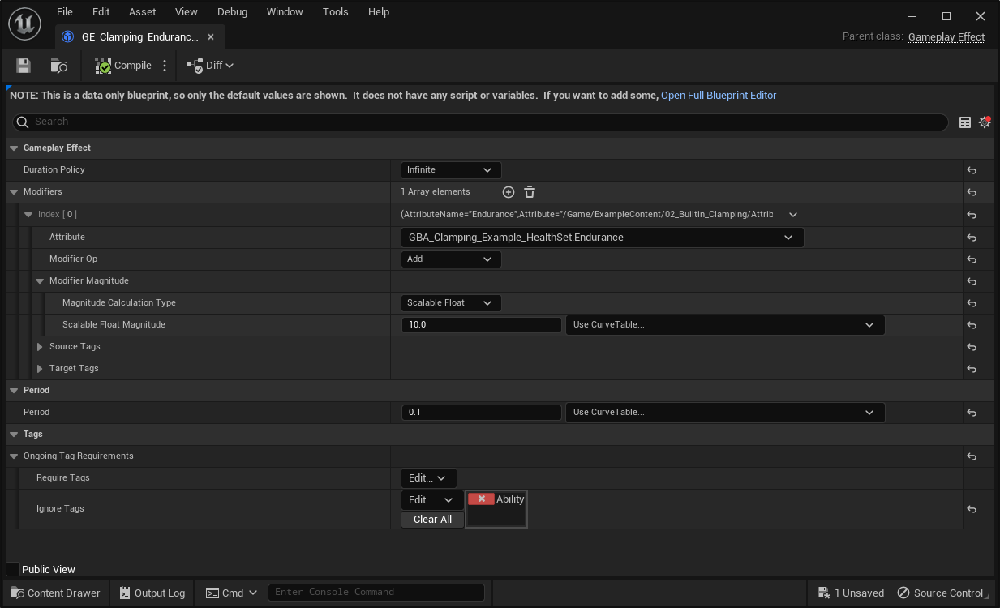

import { Callout } from 'nextra/components'
import Zoom from 'react-medium-image-zoom'


# Getting started

## Create a Blueprint Attribute Set

First thing first, we need to create the Blueprint for our Attribute Set. To do so, right click in the Content Browser and click on:

`Gameplay > Gameplay Blueprint Attributes > Gameplay Blueprint Attribute Set`


The prefix used here for Blueprint Attribute Sets will be "GBA_", standing for Gameplay Blueprint Attributes.

We're going to implement a simple AttributeSet to hold a Health variable: GBA_Health_Set


<Callout type="default">
It is highly recommended to always use the Context Menu asset action to create new Blueprint Attribute Sets.
</Callout>

Doing so will ensure the Blueprint is using a specific UBlueprint (UGBAAttributeSetBlueprint) and a customized BlueprintEditor (FGBABlueprintEditor). We will go over briefly each of its features.

## Blueprint Attributes Editor

Upon first opening, the Blueprint Editor will look like this.

<Zoom>

</Zoom>

A few additional buttons can be found in the toolbar, next to the PIE and Debugging controls.


We will go over each of these buttons shortly.

### Creating a new Attribute

#### Add Attribute Button

But first let's click on the "Add Attribute" button.


This combo button brings up a new panel with a form and a few inputs to help with the creation of new Gameplay Attribute properties.

- The type can be either FGameplayAttributeData or FGBAGameplayClampedAttributeData (FGameplayAttributeData with built-in clamping features)
- The Replication checkbox can be used if the Attribute needs to be replicated, and will generate the appropriate Rep_Notify function and implementation.


It's a quicker and less error-prone way of creating a new Gameplay Attribute variable, by enforcing proper types and saving a few clicks / manual steps.

You should now have a newly created Gameplay Attribute variable, with type FGameplayAttributeData.


Along with an "OnRep_Health" function (the rep notify) if you checked the Replication checkbox.

#### Attribute Details

With the Health variable selected, the Detail panel should look like this.


The important part that is customized by the plugin is the Default Value panel, where you can see the Base and Current value of the Attribute, and change its default value directly from within the Blueprint Editor (courtesy of one of our Details customization class, FGBAGameplayAttributeDataDetails).

#### Rep Notify

if you checked the Replication checbox, a rep notify function should be implemented for you, with the required call to HandleRepNotifyForGameplayAttribute().


The main role of HandleRepNotifyForGameplayAttribute() is to handle attributes that will be predictively modified by clients, something that is usually done with GAMEPLAYATTRIBUTE_REPNOTIFY helper macro in C++.

### Class Defaults

Now that we have at least one variable created, we can take a look at the Details panel for the Class Defaults (by clicking on this button in the toolbar)


It is adding a new "Add Attribute" button (same function as the one in the toolbar) and listing each and every BP variables. The Gameplay Attribute Data properties are then displayed like here, providing you a simple way to see and tweak all your Attributes at once and their default values.


Here is an example with an Attribute Set and more Gameplay Attributes.


#### Details Settings

You can customize that part of the Editor with few Details Customization option in the Project Settings.

Open up the Project Settings, then scroll down to the bottom of the sidebar. You should see a "Blueprint Attributes" section where all the configurable settings for the Plugin can be found.

<Zoom>

</Zoom>

**Use Compact View**

If you turn on Compact View mode in the Project Settings, Details for Gameplay Attributes Data properties will be simplified and use a simplified display.


For both class defaults variables and when viewing / editing a single Attribute Data property, making the edition of BaseValue possible in the header of the row.


Only for simple Gameplay Attribute Data properties, clamped properties still display using the full extended version (like the Endurance Attribute above, we'll go over Gameplay Clamped Attribute properties in their own section)

**Header Format Text**

The other relevant setting is "Header Format Text".

Customize how the header row is displayed and what should be included. This is a FText::Format format string, with two floats being passed in as an argument (BaseValue and CurrentValue). Both float values are converted to String with "%.2f" to reduce precision to only two decimals (Default Value: `"Base: {0}, Current: {1}"`)



You could even get fancy and use [utf8 emojis](https://quickref.me/emoji.html) in there 😉


## Attribute Sets

### Registering the Attribute Set with the ASC

Once you create an Attribute Set with one or more Gameplay Attributes, we need to register (or grant) it to the appropriate Ability System Component.

<Callout type="info">
You can refer to [Register Attribute Sets with the ASC](/docs/project-setup#register-attribute-sets-with-the-asc) for more options.
</Callout>

Here, we'll use the `InitStats()` engine method, as part of the ASC API, to grant the Attribute Set on Begin Play.


If we know test in-game and use the gameplay debugger, we can see the Attributes properly registered with our ASC and ready to use.

#### Gameplay Debugger

Hit Play and launch the game in PIE, and open up the console command by pressing the backtick key <code className="nx-border-black nx-border-opacity-[0.04] nx-bg-opacity-[0.03] nx-bg-black nx-break-words nx-rounded-md nx-border nx-py-0.5 nx-px-[.25em] nx-text-[.9em] dark:nx-border-white/10 dark:nx-bg-white/10">\`</code> (normally located below the ESC key) on QWERTY keyboards or the `²` on AZERTY keyboards.

<Callout type="info">
You can customize this in `Project Settings > Engine > Input > Console > Console Keys`.
</Callout>

Then type `showdebug abilitysystem` in the console to display the Gameplay Debugger for Gameplay Abilities. You should in the first "Attributes" page the Attribute(s) we defined earlier.


You can also use the new `AbilitySystem.DebugAttribute` command.


Type `AbilitySystem.DebugAttribute Health` to add a little overlay for a simple display of desired attributes (you can pass a list of Attributes to display with a space separated list of Attribute names).


<Callout type="info">
- You can pass a list of Attributes to the command with a space separated list of Attribute names.
- Enter the command again to hide the overlay if it is visible (toggle behavior).
</Callout>

### Initialization

In this section, we'll talk about the various ways we have to initialize the Attribute values (the Base Value).

#### Initializing Attributes

This is a good time to talk about a Blueprint Attributes plugin specific feature. If you select the Gameplay Attribute property in the Blueprint Editor, or click on the "Class Defaults" button in the toolbar, you'll be able to change the default Attribute value directly from within the Details Panel.

Set it to an arbitrary value, for example `100`.


<Callout type="info">
This is normally not an exposed value, and not editable in the Details panel, but an Editor Details customization of Blueprint Attributes plugin is taking care of exposing that to Blueprints.
</Callout>

This is the equivalent in C++ of setting a Gameplay Attribute default value via its constructor in an AttributeSet header:

```cpp
UPROPERTY(BlueprintReadOnly, Category = "Attributes", ReplicatedUsing = OnRep_Health)
FGameplayAttributeData Health = 0.0f;
```

If we now launch the game in PIE and use the Gameplay Debugger commands, we should see the Attribute with its new default value:


#### Data Tables

Another popular way to initialize attributes beyond their default value, and further specialize Gameplay Attributes value based on the Actor (and ASC) it belongs, is through the use of Data Table.

Both the `InitStats()` method of the ASC and its Default Starting Data property (more infos and options in [Register Attribute Sets with the ASC](/docs/project-setup#register-attribute-sets-with-the-asc)) accepts an additional Data Table and a Gameplay Ability System row type called `AttributeMetaData`.

*Example using InitStats() on Begin Play or Possessed Events*


##### Creating the Data Table

###### Manually

<Callout type="default">
**Hint**: The next section explains how to do this automatically 😉
</Callout>

You can create `AttributeMetaData` Data Tables the usual way, by right-clicking in the Content Browser, and clicking on `Miscellaneous > Data Table` (or importing from an external .csv file).

In the "Pick Row Structure" dialog that appears, choose `AttributeMetaData` for the row type.

You have the option to add extra rows to support Attribute Sets with multiple Gameplay Attributes. In the file shown below, the "Health" Gameplay Attribute within GBA_Health_Set Blueprint will initialize with a value of 1000.

The syntax for the row name is `AttributeClassName.AttributeName` (without the "U" prefix for C++ defined Attribute Set, and without the "_C" suffix for Blueprint defined Attribute Set).

<Zoom>

</Zoom>

###### Automatically with `Create DataTable` Toolbar Button

The Blueprint Attributes Editor Toolbar provides an additional "Create DataTable" button to quickly create an initialization `AttributeMetaData` Data Table, based on the defined Gameplay Attributes in the Blueprint Editor.

It'll generate additional rows for each defined Attributes, with their Base Value set accordingly.

If you click on the "Create DataTable" button, you'll get the following window:

<Zoom classDialog="">

</Zoom>

If you click on "Save" next, a new DataTable asset with the appropriate row type and content generated based on your defined attributes will be created.

- The path for the DataTable is by default next to the Attribute Set Blueprint it originates from, but you can tweak this with the left panel and Tree View.
- The name for the DataTable is by default `DT_{AttributeBlueprintName}` (for instance for a Blueprint `GBA_Health_Set`, the default name for the DataTable will be `DT_GBA_Health_Set`). You can change the name of the DataTable asset in the `Name` input field.

Here is an example for a Blueprint AttributeSet with slightly more Gameplay Attributes, and their BaseValue slightly modified:

<Zoom>

</Zoom>

And here is the resulting DataTable:

<Zoom>

</Zoom>

### Built-in Clamping

Clamping of Attribute, to ensure that their values are always within the limits that you set for them, is a common pattern. That's why Blueprint Attributes plugin come with some pre-defined and built-in clamping behavior that you can opt-in.

You can perform Attributes clamping with one of three methods, two of which are the built-in clamping features coming with the plugin.

* **[with DataTable](#with-datatable)** - To initialize the Attributes, and using the MinValue and MaxValue columns. The Attribute Set Blueprint Base class is able to handle those Min/Max column values, and execute a built-in clamping behavior. 
* **[with Gameplay Clamped Attribute Data properties](#with-gameplay-clamped-attribute-data-properties)** - A customizable clamping using a special Gameplay Clamped Attribute Data property (a child of FGameplayAttributeData) with float or Attribute-based clamping.
* **[Manual Clamping](#manual-clamping)** - You'd implement the clamping behavior yourself, with your own rules with the BP exposed method / events of Attribute Sets (PreAttributeChange(), PreAttributeBaseChange() or PostGameplayEffectExecute())

`UGBAAttributeSetBlueprintBase::PostGameplayEffectExecute()` is the method responsible of clamping, and the order for those is the following:

1. Manual Clamping (if done in PostGameplayEffectExecute BP Event)
2. Clamping via Clamped Properties (if the Attribute is implemented as a `FGBAGameplayClampedAttributeData`).
3. Clamping via DataTables Min and Max value columns (if the Set was initialized with a DataTable, and if `MinValue < MaxValue`).

**Test Setup <a href="#built-in-clamping-testsetup" id="built-in-clamping-testsetup" className="subheading-anchor" aria-label="Permalink for this section"></a>**

To better illustrate the clamping behavior in-game, we'll use Gameplay Effects with Infinite duration to setup a regen and degen mechanic for the Health Attribute.

<Callout type="info">
You could also use Gameplay Abilities activated on Input, to apply an Instant Gameplay Effect to either damage or heal the Character (by adding or removing a set of amount of Hit Points from the Health Attribute).
</Callout>

<Callout type="default">
This demonstration setup can be found in the [Content Examples project](/docs/resources/content-examples-project) in the `02_Builtin_Clamping` map.

Also, most of the assets specific to this example are prefixed with `GE_Clamping_` to easily find them in the Editor with `Ctrl+P`.
</Callout>

For these instructions, I'm using an AttributeSet made just for this clamping demonstration, with a single Health Attribute variable.

*GBA_Clamping_Example_HealthSet*
<Zoom>

</Zoom>

And two Gameplay Effects, one to continuously add to the Health Attribute, one to continuously substract from the Health Attribute.

*GE_Clamping_HealthRegen*
<Zoom>

</Zoom>

*GE_Clamping_HealthDegen*
<Zoom>

</Zoom>

Both are Infinite Gameplay Effects, with a Period duration of `0.1`, and either adds or remove `10` from the Health Attribute every 100ms.

`GE_Clamping_HealthRegen` is configured to only be active if the Owner Character doesn't have `GameplayEffect.Clamping.Degen` Gameplay Tag, which is added by `GE_Clamping_HealthDegen` whenever it's applied.

Next, we need to ensure the Regen Gameplay Effect is applied. Since it's an Infinite Effect, it'll be active indefinitely (or until explicitly removed).

You can simply apply the effect programmatically on Begin Play (or Possesed) event, or using the list of Gameplay Effects to apply your GAS bakend could provide to you (GAS Companion's ASC Granted Effects, or Lyra's Ability Sets and Granted Gameplay Effects)



Without any clamping applied, the Health Attribute value will go up indefinitely.


And similarly go down if we apply the Degen effect (which is done in the Content Examples project by stepping onto the Button Pad Blueprint).



#### With DataTable

This is the simplest and quickest way to get clamping done for Gameplay Attributes.

This implies you're using a DataTable to initiliaze your Attribute values (eg. [Data Tables section](#data-tables)).

<Zoom>

</Zoom>

If we build upon our previous Attribute Set example, with a single Health Attribute, we can tweak the DataTable used for initialization and set the Min and Max value columns to arbitrary values. In the following example, we'll init the value to 0, but configure the clamping to ensure the value will between 10 to 100.


If we launch the game in PIE, we can see the value for the Health Attribute initialized to 10 (started at 0, then clamping took place and set it to 10)


To test lower and higher bound limits we configured for the clamping, we can use the Regen / Degen effect described in the [Test Setup section](#built-in-clamping-testsetup).




#### With Gameplay Clamped Attribute Data properties

Add a new Attribute for your set, but this time using a `FGBAGameplayClampedAttributeData`. You can quickly do so by clicking on the "Add Attribute" button in the Blueprint Editor Toolbar, and choosing the appropriate type.

<Callout type="default">
Once again, you can find the implementation described here as part of the [Content Examples project](/docs/resources/content-examples-project) in the `02_Builtin_Clamping` map.
</Callout>

This time, we are going to implement an `Endurance` Attribute (a classic!) that will act as a resource cost for a given set of actions. In this simplistic example, it's going to be on a Jump ability (another classic!).


If you then compile the Blueprint and select the newly added variable, you'll see in the Details panel a slightly different display.



`FGBAGameplayClampedAttributeData` is a child struct of `FGameplayAttributeData`, it contains the usual Base Value, along with two new `FGBAClampDefinition` properties: a `MinValue` and a `MaxValue`.

The Clamp definition for both of these provides a `Clamp Type` behavior:

- **Float Based (default)**: Uses a simple, static float for the clamping.
- **Attribute Based**: Performs a clamping based upon another attribute.
- **None**: Clamping is disabled for this definition.

We need another Attribute to demonstrate the Attribute Based clamping type for our `Endurance` attribute called `MaxEndurance`. Let's quickly create the new attribute.


You can then give it an arbitrary value (and / or use an initialization DataTable to set its value):


We can then go back to the clamped definitions of `Endurance`, by selecting the variable or using the Class Defaults view, and adjust the clamping definition for `MaxValue` to be based on the `MaxEndurance` attribute.

<Zoom>

*We also changed the initial Base Value to be at 100 to make it start from the higher limit.*
</Zoom>

<Callout type="default">
Take note that only the Attributes belonging to the same Attribute Set are intentionally selectable. This deliberate design choice serves to prevent interdependence between different Attribute Set classes and to maintain the principle of encapsulation.
</Callout>

**Test Setup <a href="#built-in-clamping-testsetup-2" id="built-in-clamping-testsetup-2" className="subheading-anchor" aria-label="Permalink for this section"></a>**

Let's quickly create a few Gameplay Effects to play around our new `Endurance` attribute value. We'll need:

- A regen Gameplay Effect to continuously add a certain amount of `Endurance` point.
- A Gameplay Effect to arbitrarely change the value of `MaxEndurance` attribute (imagine equipping an item that increase the total amount of Endurance available) which is going to indirectly affect the maximum value for the `Endurance` attribute.

<Callout type="info">
The few following Blueprints are set to "Show Only Modified Properties"
</Callout>

**GE_Clamping_EnduranceRegen**
<Zoom>

*This is an infinite Gameplay Effect*
</Zoom>

**GE_Clamping_MaxEnduranceBuff**
<Zoom>

*This is a duration Gameplay Effect, meaning it will only last for 2 second, and increase `MaxEndurance` by 10%.*
</Zoom>

<Callout type="warning">
Don't forget to apply **GE_Clamping_EnduranceRegen** just like we did for the HealthRegen as one of the startup effects to apply.
</Callout>

Time to PIE test. Here we used the `AbilitySystem.DebugAttribute Endurance MaxEndurance` command once to display their value as an additional overlay.

<details open="true" class="details-reset border rounded-2">
  <summary class="px-3 py-2">
    <svg aria-hidden="true" height="16" viewBox="0 0 16 16" version="1.1" width="16" data-view-component="true" class="octicon octicon-device-camera-video">
    <path d="M16 3.75v8.5a.75.75 0 0 1-1.136.643L11 10.575v.675A1.75 1.75 0 0 1 9.25 13h-7.5A1.75 1.75 0 0 1 0 11.25v-6.5C0 3.784.784 3 1.75 3h7.5c.966 0 1.75.784 1.75 1.75v.675l3.864-2.318A.75.75 0 0 1 16 3.75Zm-6.5 1a.25.25 0 0 0-.25-.25h-7.5a.25.25 0 0 0-.25.25v6.5c0 .138.112.25.25.25h7.5a.25.25 0 0 0 .25-.25v-6.5ZM11 8.825l3.5 2.1v-5.85l-3.5 2.1Z"></path>
</svg>
    <span aria-label="Video description video.mp4" class="m-1">*By stepping onto the Pad Button, we apply the Gameplay Effect buff to increase temporarily our `MaxAttribute` value for 2s (or removed when we step out of the Pad).*</span>
    <span class="dropdown-caret"></span>
  </summary>

  <video src="https://private-user-images.githubusercontent.com/113832/268473680-2a2dbdcc-bde8-45bb-8d15-3063ff7c4a97.mp4?jwt=eyJhbGciOiJIUzI1NiIsInR5cCI6IkpXVCJ9.eyJpc3MiOiJnaXRodWIuY29tIiwiYXVkIjoicmF3LmdpdGh1YnVzZXJjb250ZW50LmNvbSIsImtleSI6ImtleTEiLCJleHAiOjE2OTQ5MDMzOTksIm5iZiI6MTY5NDkwMzA5OSwicGF0aCI6Ii8xMTM4MzIvMjY4NDczNjgwLTJhMmRiZGNjLWJkZTgtNDViYi04ZDE1LTMwNjNmZjdjNGE5Ny5tcDQ_WC1BbXotQWxnb3JpdGhtPUFXUzQtSE1BQy1TSEEyNTYmWC1BbXotQ3JlZGVudGlhbD1BS0lBSVdOSllBWDRDU1ZFSDUzQSUyRjIwMjMwOTE2JTJGdXMtZWFzdC0xJTJGczMlMkZhd3M0X3JlcXVlc3QmWC1BbXotRGF0ZT0yMDIzMDkxNlQyMjI0NTlaJlgtQW16LUV4cGlyZXM9MzAwJlgtQW16LVNpZ25hdHVyZT0xNTU4N2U5MTIwZmQ5ZTdiOGE1ZmZhYzc0M2ZjYWE5NzI2YThjNDJmOGY0Mzc4ZTUwYWEzOWZkYTlkYjQ5NWQzJlgtQW16LVNpZ25lZEhlYWRlcnM9aG9zdCZhY3Rvcl9pZD0wJmtleV9pZD0wJnJlcG9faWQ9MCJ9.nFgRYzYQjmznhFgyWJPWOcoQlCbEd4NQLKryESgu7mk" controls="controls" muted="muted" class="d-block rounded-bottom-2 border-top width-fit" style={{ maxHeight: "640px", minHeight: "200px"}}>

  </video>
</details>

#### Manual Clamping

### Interactions with Gameplay Effects

#### PreAttributeChange / PreAttributeBaseChange

#### PostAttributeChange / PostAttributeBaseChange

#### PreGameplayEffectExecute

#### PostGameplayEffectExecute

```json
{
  "PreAttributeChange": "PreAttributeChange / PreAttributeBaseChange",
  "PostAttributeChange": "PostAttributeChange / PostAttributeBaseChange",
  "PreGameplayEffectExecute": "PreGameplayEffectExecute",
  "PostGameplayEffectExecute": "PostGameplayEffectExecute"
}
```

### Helper Methods

#### GetAttributeValue()

#### SetAttributeValue()

#### ClampAttributeValue()

### Replication

## Gameplay Effects