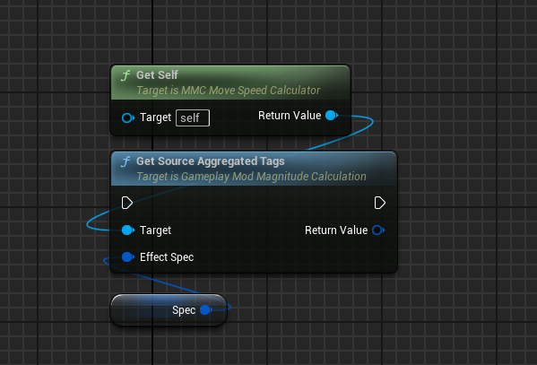
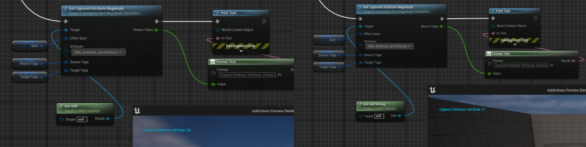

import Zoom from 'react-medium-image-zoom'
import { Callout } from 'nextra/components'

## Modifier Magnitude Calculation

<Callout type="info">
**Related** https://github.com/tranek/GASDocumentation#concepts-ge-mmc
</Callout>

### Requirements

Blueprint parent class needs to be `UGameplayModMagnitudeCalculation`.

Override the functions `CalculateBaseMagnitude`, the equivalent of the `CalculateBaseMagnitude_Implementation` when done in C++.

<Zoom>

</Zoom>

Make sure to edit the `Relevant Attributes to Capture` in Class Defaults, with all the Attributes your calculation will need.

<Zoom>

</Zoom>

### Calculation

Start implementing your calculation.

The built-in `UGameplayModMagnitudeCalculation` from the Engine already has a lot of BP exposed helpers. The Blueprint Attributes plugin doesn't need to add more (I'd just have to ensure calculation on BP defined Attributes are still working).

This includes:

- GetCapturedAttributeMagnitude()
  - For this to work correctly, the Attribute needs to be added to the Relevant Attributes to Capture array.
- GetSetByCallerMagnitudeByName()
- GetSourceAggregatedTags()
- GetSourceActorTags()
- GetSourceSpecTags()
- GetTargetAggregatedTags()
- GetTargetActorTags()
- GetTargetSpecTags()

> ~ https://docs.unrealengine.com/5.3/en-US/API/Plugins/GameplayAbilities/UGameplayModMagnitudeCalculation/

#### Warning for engine prior to 5.3

<Callout type="default">
For engine prior to 5.3, you'll need to rely on a workaround for the issue of const methods. This is fixed in 5.3 and not required anymore.
</Callout>

<Zoom>

</Zoom>

By wiring in a pure const method that returns a reference to self for any BP exposed methods of MMC (like GetCapturedAttributeMagnitude)

<Callout type="warning">
**Very important** Make sure you name the return parameter something else than `Self` or `self`.

<Zoom>
*OK on the left, NOK on the right.*

</Zoom>
</Callout>

<Zoom>

</Zoom>

## Example

<Zoom>

</Zoom>

`SourceTags`, `TargetTags`, `CapturedWeight`, `CapturedFatigue`, `FatigueState`, `Result` are all local variables.
