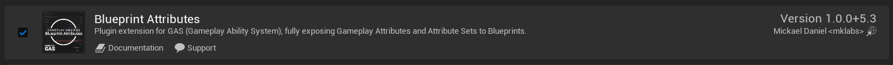
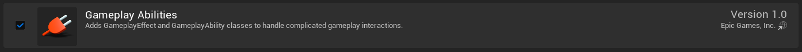
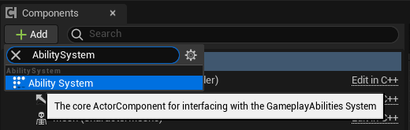
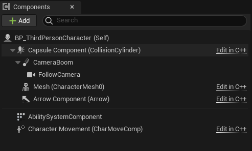
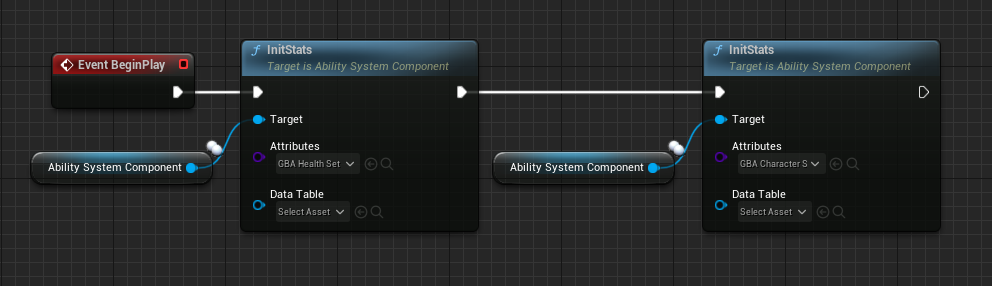
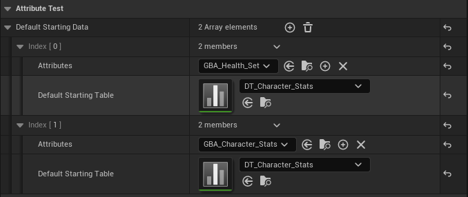
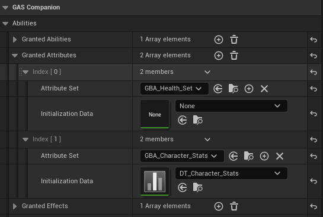
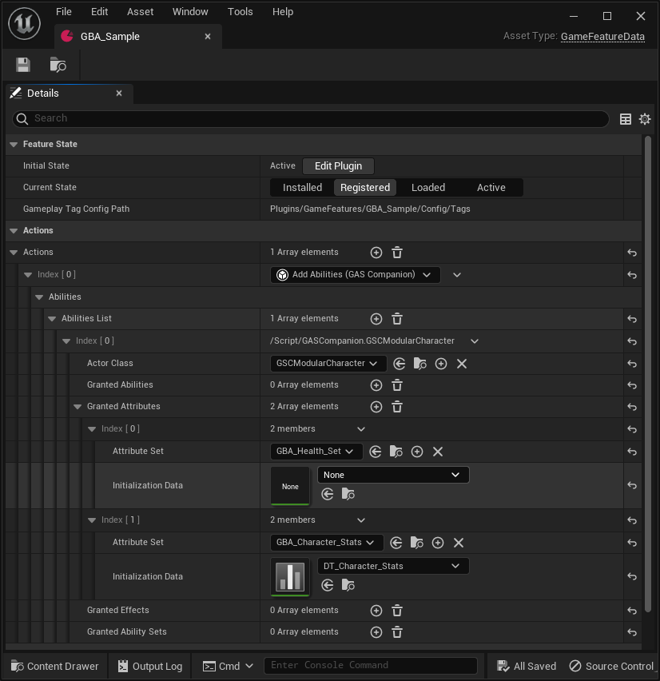

import { Callout } from 'nextra/components'

# Project Setup

The few steps explained here are the minimum requirements to get started with this plugin.

## Enabling the plugin

Make sure to enable the plugin in the Plugins Window.

Doing so will also enable "Gameplay Abilities" plugin as well (plugin dependency).

Once done, you can restart the project.

## Adding the ASC (Ability System Component)

Add the actor component "Ability System" to your Character Blueprint, rename it to AbilitySystemComponent for good measure.

*In the components panel, click the "Add" button and search for "AbilitySystem".*

*Rename the component to "AbilitySystemComponent" (optional, but it'll keep it consistent as if it was added in C++)*

<Callout type="info">
Adding the ASC to your Actors is usually done in C++ (and before engine 5.0, it was mandatory). For example in Lyra or using GAS Companion, you'd have this component created for you already. For the purpose of these instructions, we simply add the component in Blueprint and you can freely skip this step if this is applicable to you.
</Callout>

## Register Attribute Sets with the ASC

In the next sections, we are going to create Attribute Sets (in Blueprint!).

<Callout type="info">
The prefix used here for Blueprint Attribute Sets will be "GBA_", standing for Gameplay Blueprint Attributes. But you are free to choose the prefix for your project and name them as you please.
</Callout>

You will eventually have to register the Attribute Sets with the appropriate ASC for these Attributes to appear and have an impact in-game. You can do so with either:

1. OnBeginPlay and using the InitStats() method on the ASC (this is engine API)

2. You can also add the Attribute Set type to the ASC's Default Starting Data (in the details panel with ASC selected, again engine API). Keep in mind that for it to work, you need to provide both the Attribute Set type **and** a DefaultStartingTable DataTable (even if the latter is empty). This is the current engine implementation skipping initialization if the DataTable is not provided.

*Details panel with Ability System Component selected in the Blueprint Editor*

3.  A third method depends on your usual GAS backend. Be it Lyra / GAS Companion or you own implementation, they each have their own way of providing a list of Attributes to grant (conceptually similar to DefaultStartingData in 2.)
    1. With GAS Companion, you can for instance use the Granted Attributes array on the ASC or an Ability Set. In Lyra, you'll likely register Attribute Sets via a PawnData and an AbilitySet DataAsset.
    
    2. Or even,  if you use Game Features, via a GameFeature action (in GAS Companion or Lyra) and the Attributes list they both provide.
    

