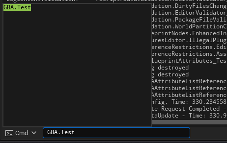
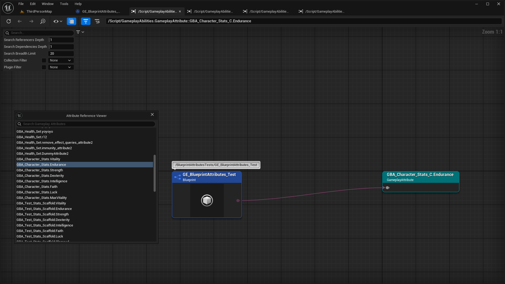

import { Callout } from 'nextra/components'
import Zoom from 'react-medium-image-zoom'

## Reference Viewer

<Callout type="info">
Since 5.3, Attributes are Asset Registry searchable, meaning Reference Viewer can be used to see their referencers (like Gameplay Tags).
</Callout>

The plugin defines a console command `GBA.Test` you can use in the command prompt (below the output log).

<Zoom>

</Zoom>

This will display a little window with all the attributes defined in the project. Upon selecting an attribute, a new Reference Viewer tab will be spawned with the choosen Gameplay Attribute as root identifier, with all the referencers assets (Gameplay Effects, etc.) displaying on the left.

<Zoom>

</Zoom>

The asset where the Gameplay Attribute is defined (like the GE in the above screenshot) needs to have been saved once by the editor for it to be "indexed" and shown in the window above.

## Referencer Handlers

There is an Editor Subsystem defined by Blueprint Attributes plugin whose role is to take care of Attribute properties renames in Blueprints. This system is called internally "Referencer Handlers".

- Detects Attribute renaming in the Blueprint Editor.
- Replace previous references to the renamed Attribute in Gameplay Effects.
- Displays a list of modified properties and Blueprint nodes (K2Nodes) in the message log with clickable links for easy navigation to the referencers.

### Renaming or removing an Attribute

For context, when an attribute is renamed (and now for an attribute being removed in this update), the plugin is trying to mitigate the issue of invalid attributes that would lead to an editor crash, by:

- Looking at the references to the Blueprint Attribute Set (GEs, etc.) where an attribute property was renamed / removed.
- For each, if we detect a rename or an attribute being removed, attribute references to the previous attribute are replaced to the new one (or a default None attribute if removed)
  - GE modifiers
  - GE Modifiers Backing Attribute
  - GE Duration magnitude
  - GE Cues backing attribute
  - GE Remove Gameplay Effect Query Component
  - GE Immunity Effect Query Component
  - K2 Nodes like GetFloatAttribute() (nodes that have an input Pin parameter of FGameplayAttribute, with the little dropdown to choose an attribute)
  - K2 Switch Node (SwitchOnGameplayAttribute) that is implemented in Blueprint Attributes plugin.

In all the scenario above, upon a rename or removal of an attribute property, an editor notification should be shown, and details can be found in the message log following the link in the notification.

## Known Limitations

The problem though will remain though if you have your own properties added, that references an Attribute. Like a `TArray<FGameplayAttribute>` variable in one of your blueprints as class variable, or a TMap with an Attribute as key or value.

In that scenario, the only reliable way is to add a core redirect, but it requires an editor restart.

### Adding a core redirect manually

to `Config/DefaultEngine.ini`

Syntax is: `{PackagePath}.{AssetName}_C.{PropertyName}`

Example for Blueprint `GBA_MyAttribute_Set`, located in `/Game/ThirdPerson/Blueprints` folder:

- PackagePath: /Game/ThirdPerson/Blueprints/GBA_MyAttribute_Set (Folder pathname + AssetName)
- AssetName: GBA_MyAttribute_Set
- PropertyName: OldAttributeName (renamed to NewAttributeName)

```ini
[CoreRedirects]  
+PropertyRedirects=(OldName="/Game/ThirdPerson/Blueprints/GBA_MyAttribute_Set.GBA_MyAttribute_Set_C.OldAttributeName", NewName="/Game/ThirdPerson/Blueprints/GBA_MyAttribute_Set.GBA_MyAttribute_Set_C.NewAttributeName")
```

### Asset move or rename

When moving or renaming the Blueprint AttributeSet asset in the Content Browser, this will crash if there are referencing k2 nodes (GetFloatAttribute() nodes, etc.), but properties in details panel are okay (Gameplay Effects).
