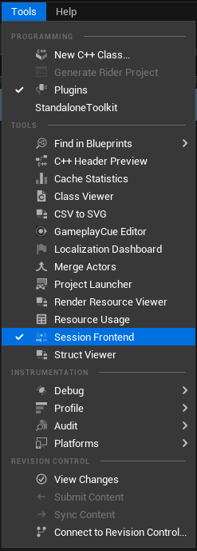
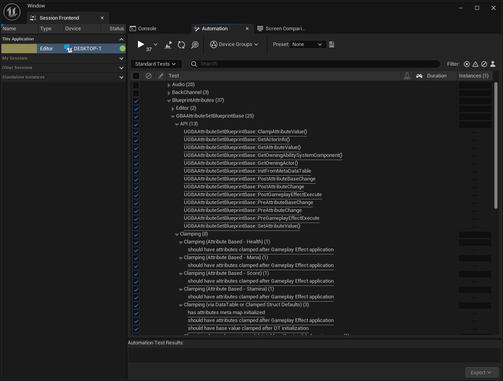
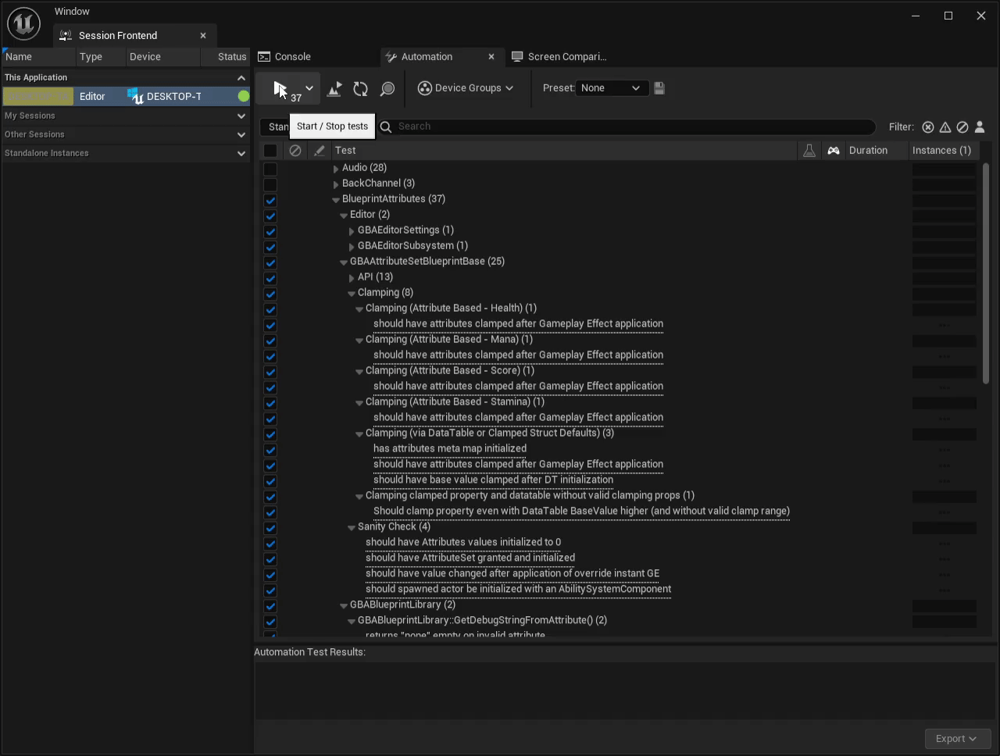

## Description

Separate plugin with unit / functional tests for BlueprintAttributes plugin: [GitHub Repository](https://github.com/BlueprintAttributes/BlueprintAttributesTests)

You can validate the plugin is working correctly by running a test suite locally.

This is run on every commit via CI and generates the following reports: [Windows](/test-reports/5.3-windows/index.html) / [Linux](/test-reports/5.3-windows/index.html)

This is a C++ plugin. You can clone it locally with (at the root of unreal project):

```bash copy
git clone https://github.com/BlueprintAttributes/BlueprintAttributesTests.git Plugins/BlueprintAttributesTests
```

## Running the Tests

Follow these steps to run the tests within the editor.

1. Start or Restart the project. You should see a prompt to compile plugin sources. Once confirmed, wait until your project launches.
2. Open the Session Frontend from the menu bar context menu `Tools > Session Frontend`.



3. Switch to the `Automation` tab. You should see a `BlueprintAttributes` category. Check the top category.



4. You can then click the Start button to run the test suite, which should pass.

