import Zoom from 'react-medium-image-zoom'
import { Callout } from 'nextra/components'
import { Tabs } from 'nextra/components'

## Saving and Loading Attributes

<Callout type="default">
This page is a work in progress
</Callout>

While BlueprintAttributes is not a Save Game framework, and save games is highly project specific, it was important to ensure BP defined GameplayAttributes are still serializable and support for Save Game is possible.

## Usage in Blueprint

### 1. Create a SaveGame BP

Create a Blueprint child of `USaveGame` to store and load variables related to your game. If you already have a SaveGame object, you're good to go and can skip this step.

<Zoom>
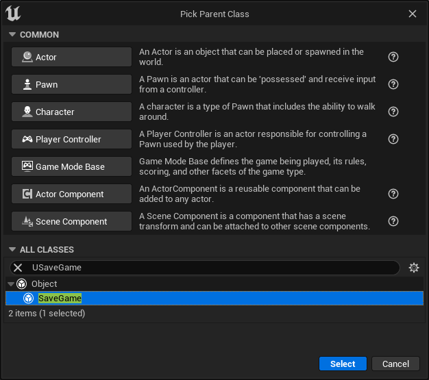
</Zoom>

Create a new variable of type `Byte`.

<Zoom>
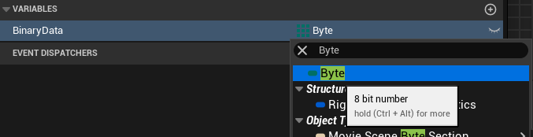
</Zoom>

Make sure to turn it into an Array.

<Zoom>
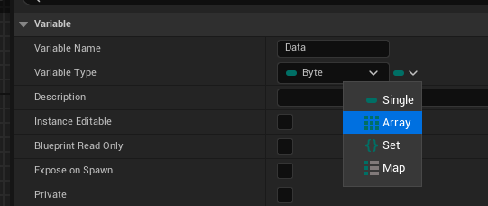
</Zoom>

You can add as many properties as you'd like to save, but ensure you create one as an array of "Byte" to be able to serialize / deserialize Attribute Sets and their Gameplay Attributes.

<Zoom>
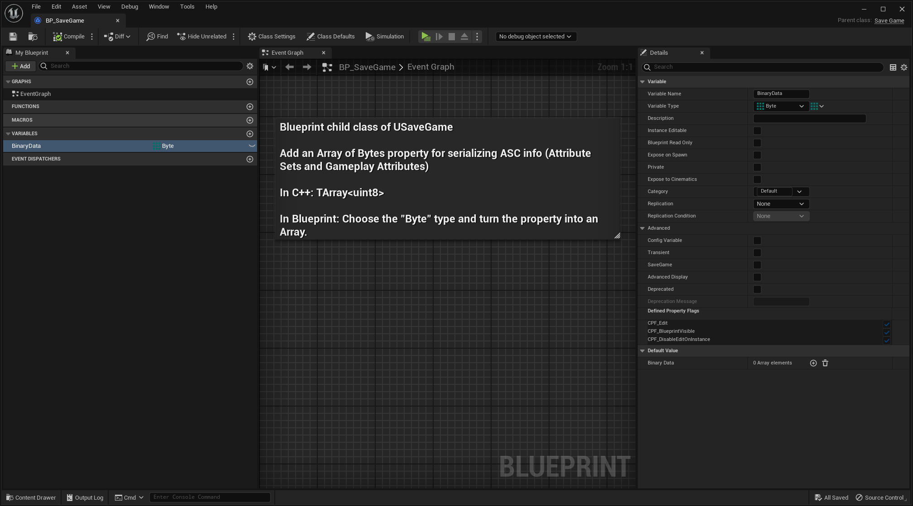
</Zoom>

### 2. Mark attributes to save with SaveGame property

To make a GameplayAttribute suitable for serialization, you can use the `SaveGame` property to mark individual attributes as "save gameable".

<Callout type="info">
Click the C++ tab below for Attributes defined in native.
</Callout>

<Tabs items={['Blueprint', 'C++']}>
  <Tabs.Tab>
  Select the Gameplay Attribute to opt-in for save game and serialization.

  In the details panel, click the "Advanced" category, and enable the `SaveGame` flag by turning on the checkbox.

<Zoom>
  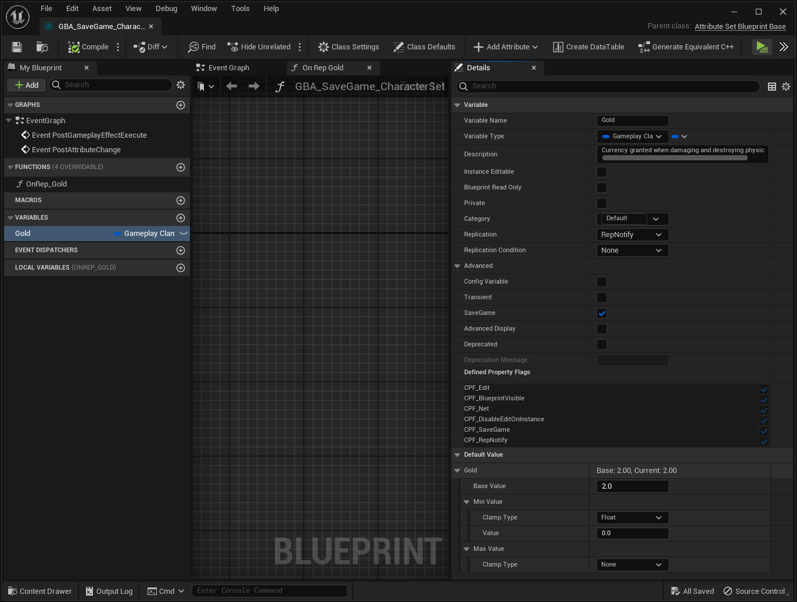
</Zoom>

  </Tabs.Tab>

  <Tabs.Tab>
  Simply add the `SaveGame` UPROPERTY specifier to your attributes.

```cpp
UPROPERTY(BlueprintReadOnly, Category = "Default", ReplicatedUsing = OnRep_Health, SaveGame)
FGameplayAttributeData Health = 0.f;
ATTRIBUTE_ACCESSORS(UClamping_Example_HealthSet, Health)
```
  
  </Tabs.Tab>
</Tabs>

### 3. On Saving

On saving and creating (or loading from slot) a save game object, make sure to call `SerializeAbilitySystemComponent` from GBA Serialization BlueprintLibrary, passing down the relevant Ability System Component (that holds the AttributeSets to save) and the array of Bytes from save game to store binary data. Make sure to turn on `bIsSaveGame` parameter to true.

<Zoom>
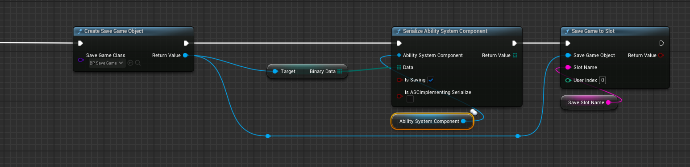
</Zoom>

The `bIsASCImplementingSerialize` can be turned on if your AbilitySystemComponent native parent class is overriding `Serialize()` and handles save game serialization. If it's not or if you attached an `AbilitySystemComponent` actor component directly in Blueprint, you can leave it turned off and ignore the explanation below.

This can be quickly implemented with:

```cpp
void UMyAbilitySystemComponent::Serialize(FArchive& Ar)
{
	Super::Serialize(Ar);

	if (Ar.IsSaveGame())
	{
		FGBAUtils::SerializeAbilitySystemComponentAttributes(this, Ar);
	}
}
```

All `FGBAUtils::SerializeAbilitySystemComponentAttributes` is doing is iterating over spawned attribute sets and calling `AttributeSet->Serialize(Archive)` on each.

```cpp
const TArray<UAttributeSet*>& AttributeSets = GetSpawnedAttributes();
for (UAttributeSet* AttributeSet : AttributeSets)
{
	if (AttributeSet)
	{
		// Assuming AttributeSet is implementing serialize and invokes FGBAUtils::SerializeAttributeSet
		AttributeSet->Serialize(InArchive);
	}
}
```

### 4. On Loading

Call the same `SerializeAbilitySystemComponent()` but this time with `bIsSaving` parameter to false, passing down the relevant Ability System Component (that holds the AttributeSets to restore) and the array of Bytes from save game where binary data was stored.

You don't need to manually handle setting the Attribute values, this is done in `SerializeAbilitySystemComponent()` automatically by reading back the stored value from the Archive (with `bIsSaving` to false).

<Zoom>
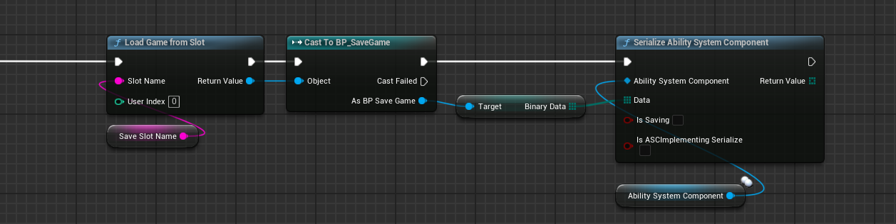
</Zoom>

### Summary

Here's a basic flow of Save / Load to save the attributes on Ctrl+S, and load them back on Ctrl+L.

1. Have a SaveGame object with an Array of Bytes property.
2. Pass down the binary data to `UGBASerializationBlueprintLibrary::SerializeAbilitySystemComponent()`
3. Make sure bIsSaving is turned on Save, and turned off on Load.

<Zoom>
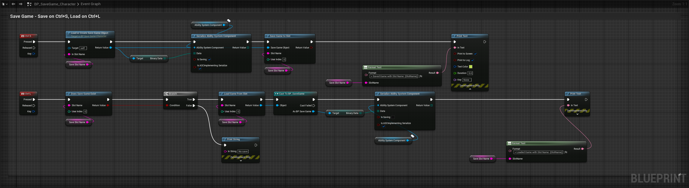
</Zoom>

<Zoom>
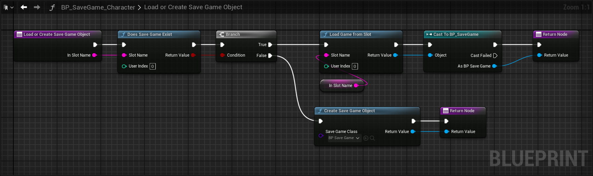
</Zoom>

<Zoom>

</Zoom>

## Integration Examples

### With Easy Multi Save

Work in progress section, but briefly:

- Gameplay Attributes to save must have the SaveGame flag (as described [here](#2-mark-attributes-to-save-with-savegame-property))
- The AbilitySystemComponent to serialize must implement and override the Serialize method, can only be done in native.

<Tabs items={['Header', 'Source']}>
  <Tabs.Tab>
```cpp
UCLASS(ClassGroup=(Custom), meta=(BlueprintSpawnableComponent))
class EMSEXAMPLES_API UEMSAbilitySystemComponent : public UAbilitySystemComponent
{
	GENERATED_BODY()

public:
	virtual void Serialize(FArchive& Ar) override;
};
```
  </Tabs.Tab>

  <Tabs.Tab>
```cpp
void UEMSAbilitySystemComponent::Serialize(FArchive& Ar)
{
	Super::Serialize(Ar);

	if (!Ar.IsSaveGame())
	{
		return;
	}

	const TArray<UAttributeSet*>& AttributeSets = GetSpawnedAttributes();
	for (UAttributeSet* AttributeSet : AttributeSets)
	{
		if (!AttributeSet)
		{
			continue;
		}

		AttributeSet->Serialize(Ar);
	}
}
```
  </Tabs.Tab>
</Tabs>

- The Owner Actor must have the AbilitySystemComponent as one of its actor components (can be added in Blueprint from the components window)

<Zoom>
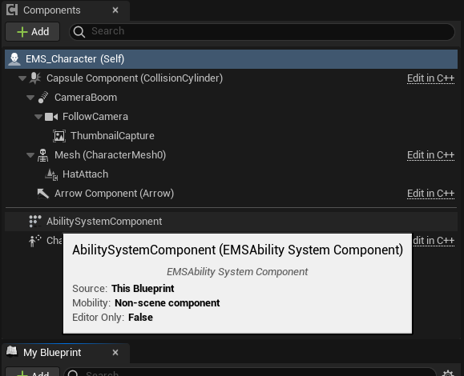
</Zoom>


- The Owner Actor must return it as components to save in the EMS provided interface "ComponentsToSave" implementation.


<Zoom>
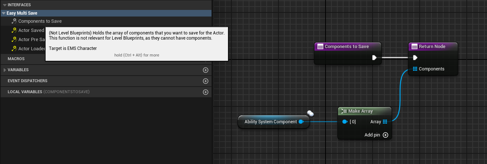
</Zoom>